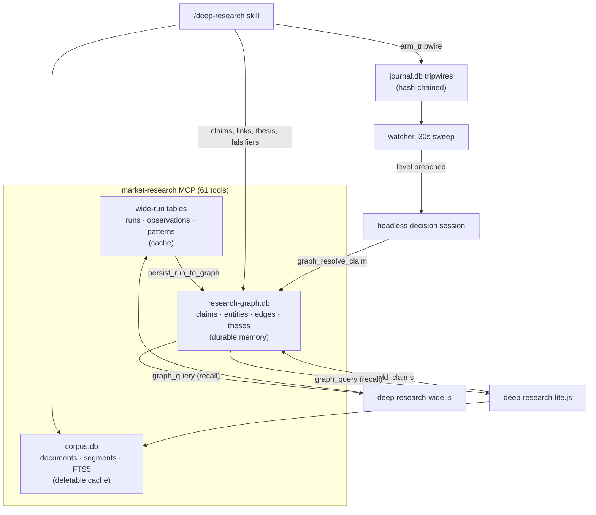
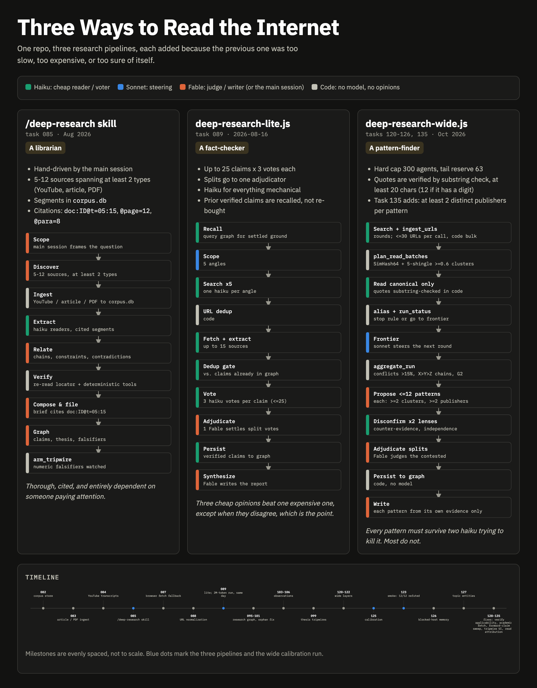
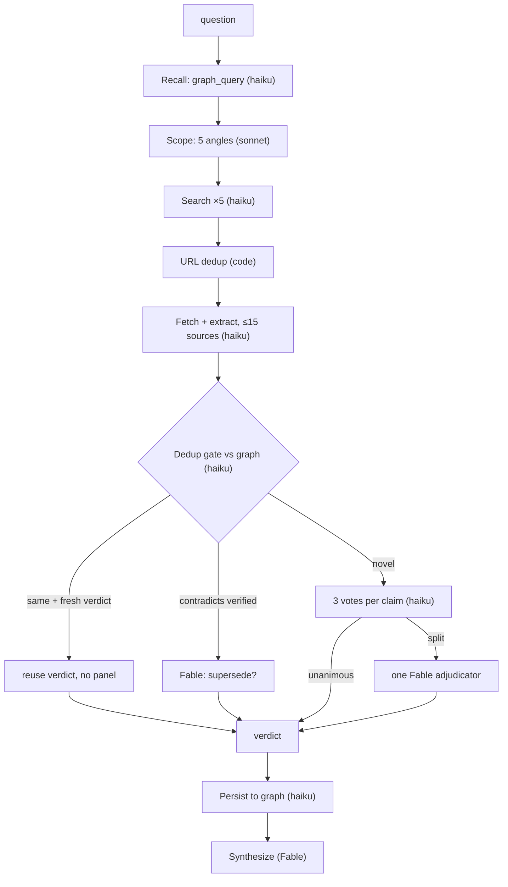
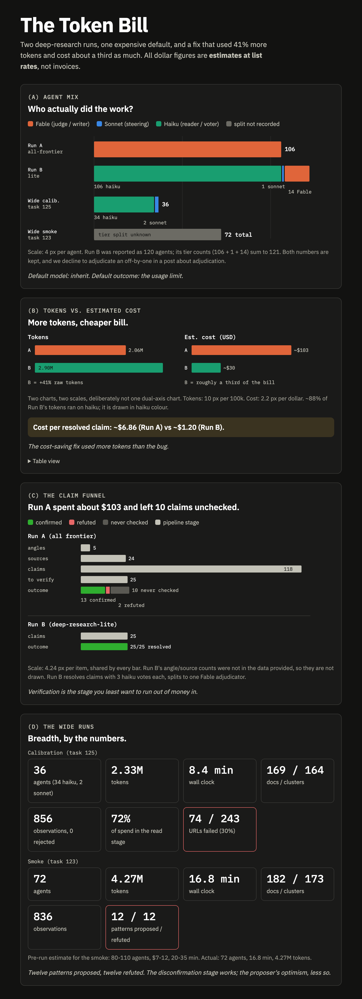
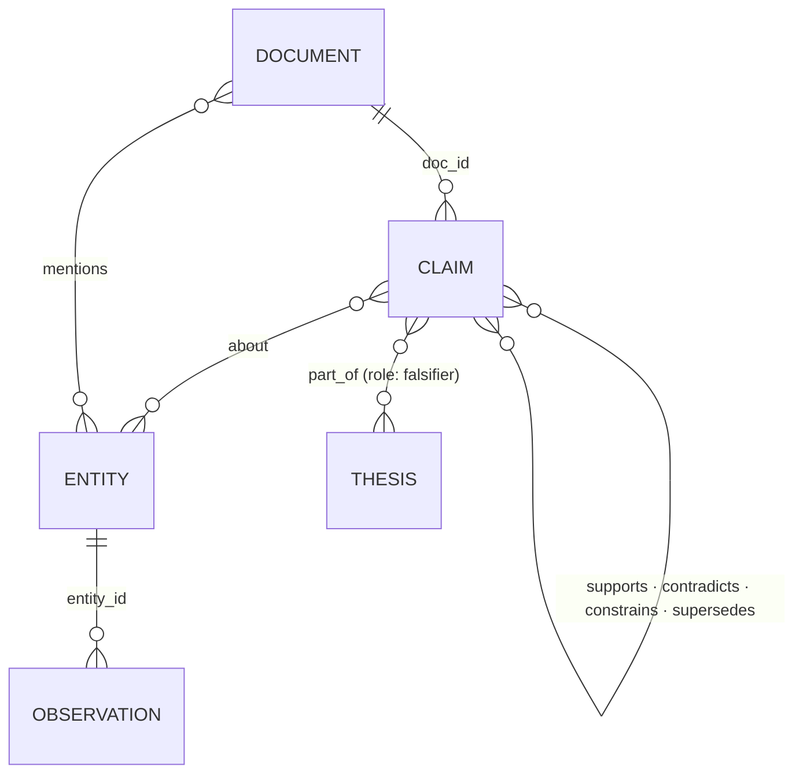
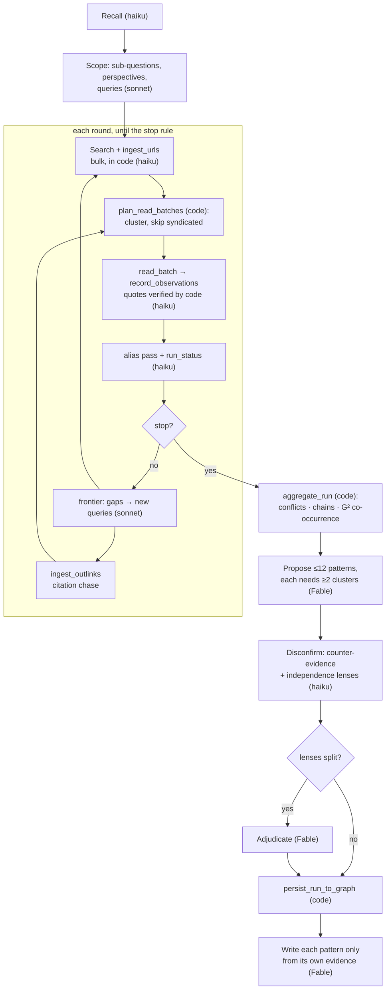
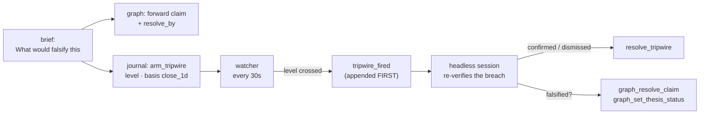

# Deep Research on a Token Budget

*An AI research desk, a 2M-token mistake, and the twelve-for-twelve audit that taught it whose profit was whose.*

*A build log for Indian-equities research: three databases, one ~2M-token mistake, a knowledge graph that knew nothing about anything, and an adversarial verifier that went twelve for twelve. Every incident here happened, every number comes from a task file, brief or run report, and the skeptic was right more often than I was.*

*This is the research half of the story. The [previous post](/blog/how-i-built-an-ai-trading-desk) covered the broker, the hash-chained ledger, the watcher and its phantom stop-losses. Where the two stories touch, this one points back instead of retelling.*

> **Disclaimer.** Nothing here is investment advice. Companies are named because the system read about them, not because anyone should buy them. All times are IST.

---

## Cold open: Hindalco, briefly an IT company

On the morning of 8 October 2026, my newest research workflow, `deep-research-wide`, finished its first full live run. I had asked it a deliberately boring question: *how did brokerages' Nifty 50 FY27 earnings-growth forecasts change during 2026?*

In 16.8 minutes it ingested 182 documents, grouped them into 173 independent source clusters, extracted 836 observations (each with a verbatim quote that code had checked against the source text), and proposed 12 cross-source patterns. Two skeptical reviewer agents then tried to knock each pattern down, and a judge model settled the cases where they disagreed.

All twelve patterns were refuted.

The refutations were correct, and that is where the comedy starts. One pattern rested on a striking conflict: TCS's Q1 FY27 net profit was somewhere between ₹7,013 crore and ₹20,946 crore, depending on the source. That is a wide range for a company that publishes one number per quarter. It turned out the ₹7,013 crore belonged to Hindalco and the ₹20,946 crore to Reliance. A reader agent had found real sentences in real articles, quoted them exactly, checked the quotes against the page, and filed them under the wrong company.

Philosophers have a name for this. In 1963 Edmund Gettier published a three-page paper showing you can hold a belief that is *justified* and *true* without it being *knowledge*: you are right, but for the wrong reason. Every observation was justified (verbatim quote, code-verified), every quote was true (the article really said it), and each one was about a different company.

The validator accepted 856 observations from the earlier calibration run and rejected none. It checked that you were wearing shoes. It never asked whose shoes.

This post is about how I got there, which was mostly by fixing the previous embarrassment. It covers 61 tools, three deep-research workflows built in a deliberate order, three databases with three different trust levels, and an evolving theory of how a language model should be allowed to know things.

---

## The numbers, up front

| | |
|---|---|
| Market-research MCP tools | 61 (9 market data · 13 fundamentals/ownership · 4 news · 6 corpus · 16 wide-run · 13 graph) |
| Deep-research workflows | 3: a hand-driven skill, `deep-research-lite` (fact-checker), `deep-research-wide` (pattern-finder) |
| Stores | 3: `corpus.db` (deletable cache) · `research-graph.db` (durable memory) · `journal.db` (hash-chained money ledger) |
| Cost per resolved claim, before and after per-stage models | ~$6.86 → ~$1.20 (estimated at list rates) |
| Research runs since, by tokens | 2.33M · 2.9M · ~3.0M · 4.27M · ~4.8M |
| Largest research run | 182 documents · 836 observations · 72 agents · 4.27M tokens · 12 of 12 patterns refuted |
| URLs that refused to load | 74 of 243 (30%) in the calibration run, 47 of them via bot-challenge pages served as HTTP 200 |
| Document pairs measured by hand-calibrated clustering | 13,695 |
| Concept claims with nothing to be about, before `topic` entities | 33 (now refused at the tool boundary) |
| Python tests | 116 → 1,418, test-first throughout |

---

## The map

Before the history, here is the territory. Claude Code drives everything. Three local MCP servers are its hands (MCP, the Model Context Protocol, is the plug-in standard that lets an agent call tools). This post is about one of them, `market-research`, and the research machinery that grew on top of it.



The three stores have three trust levels, and that split turned out to be the most important design decision in the project:

1. **`corpus.db`** is a cache. Everything in it can be fetched again, and deleting the file is always safe. It holds documents cut into *segments*, and the segment is the unit of citation.
2. **`research-graph.db`** is memory. Verified claims are expensive to re-derive, so they are never deleted, only *invalidated* by a newer claim.
3. **`journal.db`** is the money ledger: append-only and hash-chained. Research is not allowed in until it has become a trade proposal or a tripwire.



*The three workflows side by side, colour-coded by model tier, with a timeline of every task. [Interactive version](https://claude.ai/artifact/GZ9jewDp6oeTDn38cL9MLg).*

---

## Act 1: Fifteen tools, then sixty (10–11 August)

The research server was born on 10 August with a modest goal: let the agent read numbers instead of eyeballing them.

**Task 012** wrapped Yahoo Finance for fundamentals. The first design note set the tone for everything after it: *"Statements are transposed to one-record-per-period (much easier for an AI reader than yfinance's line-items-as-rows). All yfinance failures collapse to `DATA_UNAVAILABLE` structured errors."* Payloads shaped for the decision being made, and every failure a tidy error code, which is the only kind of manners a tool can have.

**Task 013** built the NSE client, which meant learning how India's National Stock Exchange feels about scrapers. It doesn't like them. NSE returns 401 or 403 for anything that doesn't look like a browser that visited the home page first, so the client does a cookie warm-up, sends browser headers, and retries once on 401 with a fresh session before it degrades to `NSE_UNAVAILABLE`. One test-writing gotcha survives in the notes: *"a respx route registered without a path matches EVERY path on that host."* The mock version of NSE was more welcoming than the real one.

By the end of the day the server had 15 tools, then 17. News came from six Indian RSS feeds plus Google News and GDELT. The next morning, **task 036** verified the GDELT archive search the hard way: *"this network spent ~40 minutes in a sustained 429 penalty box during verification — the 429 error path was therefore verified live before the happy path was."* It's the only feature in the repo whose error branch shipped with better test coverage than the success branch.

**Task 033** taught the PDF reader that the exchange's own archive ships corrupt files: *"ZENTEC FY26 AR, no %%EOF, MuPDF repairs to 0 pages — same bytes via curl and the nse lib session, so it's bad at source."* That got a regression test and its own error code.

Then there was **task 032**, a stock screener built for the doctrine of the week, "underdogs over hype". Its first live scan returned 424 small-cap matches. The doctrine was revoked two days later, on 12 August, in favour of evidence-based qualification gates. The screener survived the ideology it was built for. The doctrine had a half-life shorter than the coffee.

The day closed with a rule that would generate half the later tasks (**task 031**): *a failing source creates a task.* The previous post met this rule from the trading side. For research it mattered more, because a research run that quietly loses a source still produces a confident brief. Hold that thought until Act 6.

---

## Act 2: Computing instead of eyeballing (12–14 August)

Trading setups ask for specific numbers: is the 20-day EMA above the 50-day, which is above the 200-day? What is the 2-period RSI? Before **task 057**, the agent answered by reading raw OHLC JSON and doing arithmetic in its head, which is roughly how I do it and just as unreliable.

`analyse_candles` moved that into pure Python: moving averages, RSI, ATR with a suggested stop, relative volume, swing points, pattern flags, 52-week distance. (Its library's "62 candlestick patterns" that silently return zeros, and the all-null TATAMOTORS quote, are in the previous post. They were also the first sightings of this post's villain, the *silent success*: an answer that looks exactly like a correct one.)

Two villains of the week that weren't in that story:

- **A ₹12 dividend faked a gap.** Yahoo's dividend adjustment marked ICICI Bank's prior bars down ~0.82%, turning a true ~0.5% opening gap into an apparent 1.3%. The gap setups screen on "≥ 2%" and "1.5–4%", so an accounting adjustment could open a trade. The note is admirably unbothered: *"Not a broken data source… the data is correct, our reading of it was naive."*
- **The Nifty could not be found (task 077).** Gate 4 of the stock-qualification checklist checks the market regime against the Nifty 50, `^NSEI`. The symbol resolver apparently appended `.NS`, then `.BO`, and asked Yahoo for `^NSEI.NS`, which does not exist. Until the fix, the agent used the NIFTYBEES ETF as a proxy.

That last one is a Sartre joke. Sartre orders coffee with no cream, and the waitress says they're out of cream; would he like it with no milk instead? Our version: *"I'd like the Nifty." "We're out of Nifty. Would you like NIFTYBEES?"* The internet, it turns out, has a lot of no-milk on offer.

---

## Act 3: The corpus, and the first deep-research workflow (16 August)

On 16 August, eight tasks (082–089) were created, started and finished in one day. This is where "research" stopped meaning *call a tool and read the answer* and started meaning *build a body of evidence and cite it.*

### The citation unit (082–084)

**Task 082** built `corpus.db`: SQLite with FTS5 (SQLite's built-in full-text search), holding documents cut into segments. Every segment gets a locator, and every search hit comes back with a pre-built citation:

```
doc:12@t=05:15     a YouTube transcript, 5 minutes 15 seconds in
doc:7@page=134     page 134 of a PDF
doc:3@para=9       paragraph group 9 of an article
```

That format is the backbone of everything after it. A claim without a `doc:` locator that `read_corpus_document` can confirm does not get into a brief.

**Task 083** added article and PDF ingestion. **Task 084** added YouTube transcripts via `yt-dlp` (metadata and captions only, no media downloads) and immediately met YouTube's rolling auto-captions, where each caption event repeats the previous one's text. Left alone, every quote would stutter and every search snippet would read like a skipping record, so a dedicated dedup fixture was written. `yt-dlp` has no upper version pin, on the principle that *"YouTube breakage is fixed by upgrading."* We depend on a library whose release schedule is "whenever YouTube changes something."

### The skill (085)

**Task 085** wrote the first deep-research workflow. It wasn't a script; it was a **skill**, a set of instructions the main session follows by hand:

```mermaid
flowchart LR
  U["sources: video, article, PDF"] --> I["ingest_source"]
  I --> C["corpus.db segments<br/>with locators"]
  C --> L["claim ledger<br/>doc:ID@locator"]
  L --> RL["Relate: chains,<br/>constraints, contradictions"]
  RL --> VF["Verify: re-read locator<br/>+ deterministic tools"]
  VF --> BR["Brief in reports/research"]
  BR --> GC["graph claims + links"]
  GC --> TH["thesis + falsifiers"]
  TH --> TW["arm_tripwire"]
```



Phase 5, *Relate*, was the ambitious part. Instead of summarising sources one by one, it hunts for **chains** (source A's number is a premise of source B's argument), **constraints** (a number in one source caps a claim in another) and **contradictions**, which go into the brief with both sides shown. The output isn't a pile of summaries. It's a causal chain where every link carries its citation, its numbers, what it *licenses* and what it *forbids*.

### The first brief: AI runs on electricity

The acceptance run asked a question I'd been chewing on: *do power-infrastructure lead times cap the return on AI capex before the chips depreciate?* It used five sources: a YouTube video (34 timestamped segments), three articles and one PJM PDF. One reader sub-agent extracted 20 claim rows, and every load-bearing number was re-verified at its locator.

The brief, *The Two Clocks*, is still one of the best things the system has produced. The argument:

- **The chip clock runs in years.** Accelerators stay competitive for 2–6 years. There is a contested allegation of ~$176B in understated depreciation across 2026–28.
- **The grid clock runs in decades.** US interconnection queues have grown from under 2 years (2008) to over 8. GE Vernova's gas-turbine backlog reached 100 GW against ~20 GW a year of output, about five years sold out.
- **The hinge is an auction.** PJM, the largest US grid operator, runs a capacity auction. The 2027/28 auction cleared **at the FERC price cap, $333.44/MW-day**, its third consecutive record, and *still* fell **6,623 MW short** of the reliability requirement. That was the first time the whole region fell short. Only 774 MW of new generation cleared. The brief's line: *money no longer buys megawatts.*

Read that again: the auction cleared at the price cap, for the third record in a row, and *still* came up 6,623 MW short. The most advanced industry of the decade is bottlenecked by an extension cord, and the extension cord has an eight-year waiting list.

The India read was just as sharp. Over the trailing year, the makers of scarce grid hardware were up (Hitachi Energy India +80%, GE Vernova T&D +53%) and the utilities that buy it were not (Power Grid −8%). Transformers & Rectifiers, down 41%, served as a reminder that a theme doesn't guarantee execution. The brief explicitly licensed **no trade**.

Its *What would falsify this* section named the thing to watch: **"Watch: June 2026 PJM BRA results."**

The brief is dated 16 August 2026.

Our first deep-research brief named, as the thing to watch, an auction scheduled for a month that was already two months behind it. It had strong justification for believing the auction lay ahead, and no way to rule out a calendar. Nothing armed it, either; in August a falsifier was a sentence in a markdown file. This becomes four tasks in Act 8.

### 403 Forbidden, then "captcha" (087–088)

One of the brief's sources, Utility Dive, *"persistently 403'd"* behind Cloudflare, and the brief lost a source. Per the failing-source rule, that became **task 087**: a browser-grade fetch fallback. Tier 1 is `httpx` with a realistic Chrome header profile. On 401/403/406/429/5xx, or when a 200 response body looks like a JavaScript challenge, it escalates to tier 2, headless Chromium via Playwright.

Live verification found a lovely false positive. Utility Dive's article page embeds Google reCAPTCHA for a form, so the bare indicator string `captcha` matched, and the fetcher declared the page it had just successfully rendered "still blocked". It beat the bouncer, walked inside, saw a poster that said "bouncer" and left. The fix uses vendor-specific markers only (`px-captcha`, `geo.captcha-delivery.com`). The exact PJM auction page then ingested cleanly as `doc:7`, and `doc:7@para=5` now cites the auction's clearing data.

**Task 088** normalised URLs so that `?utm_source=twitter` stops creating duplicate documents. It strips 14 tracking parameters, but **not** `v`, `page`, `ref` or `source`, which the prototype scraper it borrowed from stripped too. Stripping `v` breaks every YouTube link, which you'd notice eventually, at the worst possible moment.

### The podcast that was an enum value (086)

**Task 086**, Whisper audio ingest, was filed the same day and deliberately deferred: *"heaviest ingestion path; filed now so the capability gap is recorded."* For a long time the podcast ingester existed only as `kind='audio'` in a SQL CHECK constraint (a rule listing the values a column may hold), reserved so that adding it later would need no migration. It's the only feature I've shipped as a schema enum before writing any code. It landed eventually, behind an optional `[audio]` extra, as planned.

Then the same afternoon, a second deep-research run went out to ask a different question, and the day stopped being fun.

---

## Act 4: Default model: inherit (still 16 August)

The previous post told the money side of this: a stress-test question about rolling E20 ethanol blending back to E5, 106 agents that all inherited the frontier model because nobody set one, 2,058,804 tokens, the session usage limit hit mid-verification, and 10 of 25 claims never checked. Here's the research side: what the run was doing when it died, and what replaced it.

The pipeline was textbook multi-agent research: 5 search angles, 24 sources, 118 extracted claims, the top 25 sent to 3-vote verification panels. That's 75 of the 106 agents spent on the most mechanical job in the system: read one claim, read one source, say yes or no. Every one of those votes got a philosopher-king to do the filing. Even the synthesis step failed, returning "13 verified claims unmerged", so a human finished the brief.

And the irony you've been waiting for: **the same afternoon we spent 2.06 million tokens, we filed a brief arguing that the binding constraint on AI is how much power you can get.** We were, in a small way, the thesis. Our most exhaustive research tool did not eat a regional grid. It ate one session's usage limit, at agent 76 of 106.

### Task 089: price every stage

The replacement is a JavaScript script run by Claude Code's Workflow tool, with **a model assigned to every stage** and a wrapper that refuses to run an agent without one:

```js
const SCOPE_OPTS  = { model: "sonnet", effort: "medium" }
const SEARCH_OPTS = { model: "haiku",  effort: "low" }
const VOTE_OPTS   = { model: "haiku",  effort: "medium" }
const JUDGE_OPTS  = { model: "fable",  effort: "high" }   // adjudication + synthesis only
const call = (prompt, opts) => {
  if (!opts || !opts.model) throw new Error("agent call without a model: " + (opts && opts.label))
  agentCalls++
  return agent(prompt, { ...opts, model: opts.model })
}
```

The economic idea: Haiku is the cheap tier, Sonnet the middle and Fable the top. Haiku does the search, the fetching and the 3-vote panels. Unanimous panels (3–0 or 0–3) decide by themselves. Only a **split** panel escalates, to *one* Fable adjudicator, which reads the primary source. The expensive model only rules on the cases that are actually contested.



Two details the money story skipped. First, the dedup gate: before any panel runs, one Haiku call compares each new claim with the graph and answers `same`, `contradicts` or `novel`, with the instruction *"when unsure, say novel: a wrong `same` silently reuses a stale verdict."* A claim the graph already holds as freshly verified skips its panel entirely. Second, the wrapper above is backed by a lint test that parses the workflow source and fails CI if any `agent()` call lacks a model. (Why the file is called `-lite` at all, a name collision with Claude Code's built-in `deep-research`, is also in the previous post.)

### More tokens, smaller bill

The smoke test (a SEBI index-options question) ran **120 of 120 agents with zero errors**: 106 Haiku, 1 Sonnet, 14 Fable (13 split-vote adjudications plus the synthesis). All 25 claims resolved. (Yes, 106 + 1 + 14 is 121. The task log says both things, in consecutive lines. A blog post about verification would be the wrong place to quietly fix it.)

The headline numbers (more raw tokens, about a third of the bill) are in the previous post. The ones it didn't have: Haiku made **782 tool calls where the frontier run made 377**, so cheap is chatty, and the run took **3.6×** the wall-clock time. Per *resolved* claim, which is the unit that matters, the estimate went from **~$6.86 to ~$1.20**. (Estimates at list rates, on two different questions; the follow-up artifact says so in bold.)



*Agent mix by model tier, tokens against estimated cost, and the claim funnel of both runs. [Interactive version](https://claude.ai/artifact/2VAwoP3WvSGi8j3jaaPx1m).*

Cheaper didn't mean dumber, either. The Haiku panels split 2–2 on several claims about SEBI's margin rules, and the Fable adjudicator settled them by reading the actual SEBI master circular, section by section. One claim was refuted because it said "phased lot size increases" when the data showed the Nifty lot going from 75 to 65, a net *decrease*. The cheap tier noticed something was off, and the expensive tier went to the primary source. That's the division of labour working as intended.

### The E20 brief, eventually

It got finished, by hand, from the 13 confirmed claims. If E20 rolled back, assured ethanol offtake would fall from 990 to about 250 crore litres (−75%) against ethanol supply that had been built up past 1,040 crore litres, and roughly 4 MT of sugar-equivalent would flow back into the sugar market. The government had ruled out a rollback three times on record, so the brief framed itself as a stress test, not a forecast, under the memorable heading *policy is the counterparty.* The panels refuted two plausible-sounding claims 0–3, including a "17× capacity to 661 crore litres" figure that would have made a fine chart and a false one.

---

## Act 5: Memory, or the graph that knew nothing (17–18 August)

The workflows could now produce verified claims. They forgot them as soon as the brief was filed. The next run on a related question started from zero and re-verified the same facts at full price. The answer was a third store.

### The research graph (095–098)

**Task 095** built `research-graph.db`, borrowing from Graphiti (bi-temporal invalidation) and Palantir's ontology model (typed objects, links and actions). It started with 42 tests, written first:



Three design rules, all from the module docstring:

1. **Invalidate, don't delete.** A wrong claim gets `invalidated_at`, `invalidated_by`, a reason, and a `supersedes` edge from its replacement. Claim text is immutable.
2. **Closed vocabularies.** Entity types, claim statuses and edge relations are CHECK-constrained enums. An agent can't invent a relation called `vibes_with` at ingest time.
3. **Flag staleness, never filter it.** A `state` claim ("FII ownership is 18%") goes `stale` after a 90-day half-life. A `forward` claim ("X will happen by 31 December") goes `due` once its `resolve_by` date passes. Queries return the flags, and the caller decides.

Every claim also carries a `claim_time`: `historical`, `state` or `forward`. That one field quietly underpins the whole system. "TCS made X in Q1" never decays, "TCS is the market leader" decays, and "TCS will grow 5%" must eventually be checked against what actually happened.

**Task 096** made every fetch register itself as a document node, with zero LLM calls. **Task 097** taught the lite workflow to persist claims *before* synthesis, *"so claims survive a failed synthesis."* That one came straight from Act 4. **Task 098** added **recall**: before researching anything, query the graph. Fresh verified claims are settled ground and skip the 3-vote panel (`graphReused`). Claims that contradict a verified claim go straight to the adjudicator, which decides whether the new one supersedes the old.

### The path that pointed at the wrong graph (099)

The `/graph` explorer (its built-before-the-data origin story is in the previous post) produced one finding worth keeping. The graph DB path is *relative*. The web app, running from a git worktree, read *the worktree's* `.journal/research-graph.db` while the MCP server wrote the main checkout's, and the only symptom was a silently empty graph. The empty state now prints the resolved path, *"so the ambiguity can never be silent again."* The overview is aggregated in SQL (*"never pull the whole graph"*), so its payload scales with entities, not claims: 1,028 bytes for a test graph.

### Orphans, round three: the database admits that ideas exist (127)

The first time real research landed, all 25 claims were orphans linked to no entity at all. That story, and the hand backfill that fixed it, is in the previous post. What that post couldn't tell is that the bug came back.

Seven weeks later, task 127 found **33 more orphans**, and these had a better excuse. "Momentum works in India" and "low volatility beats high volatility" are claims about *concepts*, and the graph only had entity types for tickers, companies, sectors and macro variables. There was nothing for an idea to be about.

The fix was a new entity type, `topic`, which amounts to the database admitting that ideas exist. It came with a naming doctrine: *"`symbol` = NSE ticker; `macro` = an economic variable you can measure (FII/DII flows, India VIX, Rupee, Crude oil); `topic` = a research concept/factor (Momentum, Low volatility, Trend following…); `sector` = an industry."* Topics resolve to an existing macro or sector entity first, *"so extractors can't mint twins"* ("FII flows" lands on the existing "FII/DII flows"). And `graph_add_claims` now **refuses** any batch in which a claim links no entity, naming the offending indexes *before writing anything*.

SQLite can't alter a CHECK constraint, so widening it meant rebuilding the table in one transaction with ids and foreign keys preserved. While wiring the same rule into the wide workflow's persist step, the dry-run harness caught a real ordering bug: *"`PERSIST_PROMPT` referenced `scope` before declaration."* A merge then broke a tripwire test that wrote entity-less claims, *"which task 127 now refuses by design; the test was out of date, not the code."*

So it took three tasks to get from "fix the bug" (100) to "backfill by hand" (101) to "make the bug impossible at the tool boundary" (127). That arc repeats through the rest of this post.

### Observations, briefly (103–106)

The previous post covered why measured exchange facts (shareholding, pledges, insider trades, FII/DII flows, VIX) live in their own `observations` table instead of among claims. One detail from writing it at 1 a.m. belongs here, because it's about trusting evidence: *"`test_nse_tools.py:54` mocks shareholding as {"quarter", "promoter"} while `nse.py:214` reads row["date"]/row["pr_and_prgrp"]. That mock is a fiction that passes CI."* A test fixture is a claim about the world too, and that one had no citation.

(The same night, Moneycontrol's RSS feeds turned out to be frozen in 2024 while still answering HTTP 200. That's in the previous post as well, and it's why a feed now counts as failed when nothing in it is newer than four days.)

---

## Interlude: seven quiet weeks

From 18 August to 7 October there were no research commits. The system traded. It reconciled live orders, learned on the last day of the gap that the Kite Personal plan returns `PERMISSION_DENIED` for every market-data call (so the research tools now carry *all* price lookups: no cream at Kite, but here is the dairy's front window, which is NSE's public quote). The rest of what happened in those weeks is the previous post.

What brought research back was a failure.

---

## Act 6: Peer review by cheaper peers (7 October)

On 7 October a midday scan found all 20 Nifty large caps in downtrends and the Nifty's two-year return at −5.9%, which is momentum-crash territory. The playbook had no setup built for risk-off markets, so I asked `deep-research-lite` what the evidence says about trading them in India.

It came back with **114 agents, ~4.8M tokens, and 3 confirmed claims.** Its own report card says: *"The run did not research the question to standard — do not write setups from it yet."*

Two things had gone wrong, and both became tasks.

### The academy has a bouncer (115, 129)

Thirteen of 23 sources came back with zero claims: SSRN, ResearchGate, SAGE, ScienceDirect, INFORMS, the IIM Bangalore repository, NSE's own archive. The investigation (**task 115**) found 403s on the publishers, a 60-second timeout on NSE archive PDFs (*"the bare feed UA"*), every PDF that did come back arriving as *"unreadable binary,"* and one agent that *"failed on InputValidationError (WebFetch never loaded via ToolSearch)"*: a research agent that couldn't open a web page because it had forgotten to pick up the tool for opening web pages.

The fix was `scholarly.py`. It recognises DOIs, SSRN ids, NBER working papers and ResearchGate titles, canonicalises them (so NBER w11357, its SSRN id and its DOI count as one paper rather than three independent confirmations), and falls back to an open-access copy via OpenAlex. *"OpenAlex's "open" copy for SSRN papers is SSRN itself,"* the notes observe: the open-access movement, discovering the ouroboros. NSE archive PDFs went from timeouts to clean 7- and 44-page extractions.

**Task 129** dealt with academic hosts that fail at the TLS layer. The IIM Bangalore repository presents a certificate for the wrong host (a WAF misconfiguration). efmaefm.org ships an incomplete certificate chain that *"browsers fetch the intermediate via AIA, httpx does not."* The rule: use the OS trust store, *"never by disabling verification."* Scholarly literature is free to read, as long as your TLS handshake is wearing the correct shoes.

### The voters who refuted history (128)

The second failure was more interesting. Reading 82 verification transcripts showed the 3-vote Haiku panels **refuting verbatim quotes from primary papers** (Acharya-Anshuman-Kumar on FII outflows, Coval-Stafford on fire sales) that the Fable adjudicator then confirmed. The voters had:

- marked claims "outdated" when the claims were explicitly *historical*, because the prompt never showed them `claimTime`;
- treated "no Indian evidence" and "requires short selling" as refutation, when those are *applicability* concerns, not accuracy;
- obeyed a line in their own prompt that read: **"Default to refuted=true if uncertain."**

That prompt line is a bouncer instructed to assume everyone is underage. The voters refuted a paper for being old when it had been cited as history: unsound, but consistent. **Task 128** separated accuracy from applicability. Voters now see `claimTime`, applicability goes in its own non-refuting field, and the "when in doubt, kill it" default was put on trial with a before-and-after measurement.

It may rhyme with Act 5, where 17 of the first 25 graph claims were stored as refuted: *"either a harsh adjudicator or a mis-mapped verdict."* That run's own report counted 14 refuted, not 17, so the graph and the brief disagree about how skeptical the skeptics were. That mismatch is still open, which is the honest way to leave it.

### What survived

The three claims that survived were good. Unexpected FII outflows cause a same-day drop, and about 40% of it reverses within five trading days in large and mid caps, but not small caps. The follow-up dug out the strongest India-specific result in the area: in Joshipura (2020), low-volatility portfolios compounded at 11.57% a year, against 9.66% for the whole universe and 3.02% for high-volatility ones, with a 4-factor alpha of 3.19% and a maximum drawdown of −50% against −71%. The high-volatility, low-momentum bucket compounded at −3.69%, which the brief summarised as *never buy.* The conclusion was that the gap in the playbook was **regime allocation, not an entry pattern.** That became a new `index-trend-regime` setup (task 116).

But 3 claims for 4.8M tokens made the point. The lite workflow is a **fact-checker**. It verifies 25 claims from 15 sources very well. It cannot read 300 sources, it cannot follow a lead, and it has no step that looks *across* sources for something none of them says alone.

The next day, I built that.

---

## Act 7: deep-research-wide (8 October, 07:47–09:57)

About eighteen commits in a little over two hours. The design document opens with the problem statement:

> *"[Lite] is a fact-checker. We want a pattern-finder."*

It defines a **hidden pattern** as a relation supported by **≥ 2 independent source clusters** and **not stated in full by any single one**. Source A says X → Y, source B says Y → Z, and nobody says X → Z.

The constraint that shaped everything: Claude Code's workflow runtime has a 1,000-agent lifetime cap, so one agent per URL would exhaust it on fetching alone. Hence the principle the design doc is built on:

> **Code does bulk work, Haiku reads, Sonnet steers, Fable judges.**



It was built in layers, test-first, as four tasks:

- **120, run store and bulk ingest.** `ingest_urls` takes up to 30 URLs per call across 8 worker threads, two per host, with a 75-second deadline and per-URL failure reasons. It never raises for one bad URL. Bulk state lives server-side in SQLite, and agents pass small handles (run id, round, batch number) instead of URL lists they would have to transcribe.
- **121, read batches and validated observations.** Readers get ~40k-character batches. Every observation must quote its source, and **code** checks that the quote is a substring of the cited segment (after Unicode, whitespace, quote-mark and dash normalisation). The quote must be at least 20 characters, or 12 if it contains a digit. Fabricated quotes are a documented 10–15% failure mode in the deep-research literature, so a string comparison does a job no model vote can.
- **122, aggregation.** All counting in `wide_mine.py` is in **independent clusters**, never documents or mentions. Value conflicts need the same period, the same unit and a spread over 15%. Hidden chains X → Y → Z need links from different clusters and no cluster stating X → Z. Co-occurrence uses a standard statistical test (Dunning's G², threshold 3.84, p < .05) for whether two names turn up together more often than chance.
- **123, the full workflow**, with a hard cap of **300 agents** and a tail reserve of 63 so the expensive judging stages can never be starved by an over-eager search loop.

Every `agent()` call in the script is lint-tested to set a model, with a balanced-paren, string-aware parser over the JavaScript. Act 4 is now enforced by CI.

### Independence: the Zurich problem

The hardest part of counting sources is deciding when two sources are really one. The Indian financial press runs heavily on syndication: a PTI or ANI wire story appears, lightly rewritten, on a dozen sites. Count those as twelve confirmations and a single press release can manufacture a consensus.

It's the academic-lineage joke. Paper A cites B, which cites a textbook, which cites a 1984 footnote, which turns out to be a misquoted joke from a bar in Zurich. Ten citations, one beer.

So documents get a 64-bit **SimHash**, a fingerprint where near-duplicate texts get near-identical numbers, as a cheap candidate filter, and candidates are confirmed by **5-shingle containment ≥ 0.6**, the share of one document's five-word phrases that appear in the other:

```python
def hamming(a, b): return ((a ^ b) & (2**64 - 1)).bit_count()   # how many of 64 bits differ
def containment(a, b):        # |A∩B| / min(|A|,|B|) over word 5-shingles
    sa, sb = _shingles(a), _shingles(b)
    return len(sa & sb) / min(len(sa), len(sb))   # 1.0 = one is a (footer-padded) copy
```

Only the canonical member of each cluster gets read. The rest are marked `syndicated` and cost nothing.

**Task 125**, the calibration run, measured **all 13,695 document pairs** among 166 documents and hand-checked the 16 in the decision region. True copies sat at Hamming distances 0, 0, 0, 3, 5 and 11. The nearest *distinct* pair, two different NSE index-launch press releases built from the same template, sat at 16. The one copy missed at the original 10-bit threshold was an RBI Financial Stability Report press release published as both PDF and HTML: 11 bits apart, containment 0.98. The threshold moved to 12, bracketed by regression tests that fail at 10 and guard against creeping past 15.

### The validator who said yes

The calibration run asked a broad question (*which Indian sectors offer the best evidence-backed opportunities to October 2027?*) and ran for **8.4 minutes**: 36 agents (34 Haiku, 2 Sonnet), 2.33M tokens, 169 documents, 164 clusters, **856 observations accepted and 0 rejected** across 21 batches. Reading was 72% of the spend.

Zero rejects looks like a triumph. The task notes disagree:

> *"A zero reject rate means the validator checks shape and quotes, not meaning."*

A spot check of 20 found 19 faithful and one with a sign error: "declined 2 per cent" stored as **+2.0**. A code scan found 4 sign errors among 536 valued observations. Other numbers were suspicious in their own ways:

- **novelty_yield was 1.0 in both rounds**, because 851 of 856 observation keys were distinct. Every subject was spelled slightly differently, so the "are we running out of new things?" metric said *no* with a straight face. That's how `entity_yield` and an alias pass came to exist.
- **The units split** into `%` (143) and `percent` (140), and the directions into `up` and `positive`.
- **The relevance filter cut 3 of 169 documents.**
- **A forward-looking run cited a 2018 article**, because v1 did no publication-date filtering. In v1, time was a flat circle.

The data scientist's prayer, as amended: *grant me the serenity to accept a novelty_yield of 1.0, the courage to drop the 3 irrelevant documents out of 169, and the compute budget to ignore that every subject was spelled slightly differently.*

The aggregation calibration found that the design's alias rule *"would accept 'Bharat Dynamics' → 'Bharat Electronics'"* (two different defence PSUs that share the word "Bharat"). It was replaced by a stricter rule: an acronym of the canonical name, or a strict token subset. That accepts BEL, L&T and Reliance, and rejects HDFC Bank → ICICI Bank.

### A registry of websites that have said no (126)

The calibration run tried 243 URLs and **74 failed (30%)**. Of the 59 blocked, only 12 were honest 403s. The other 47 were **bot-challenge pages served with HTTP 200**, the network equivalent of a smile and a closed door. Multibagg.ai blocked 11 attempts and whalesbook.com 6. None of the 33 blocked hosts had a single document in the corpus. A browser-tier retry on multibagg.ai returned *"still behind a bot-protection challenge after browser rendering."*

**Task 126** built institutional memory of rejection. `blocked_hosts()` lists hosts with **≥ 2 distinct blocked URLs across runs** and no successful fetch. Searchers pass the list to WebSearch as `blocked_domains`, and **one probe URL per host per run** still gets through, so a host that lifts its wall heals itself. A threshold of 2 covered 9 hosts and 56% of blocks. It's the only module in the repo that maintains a guest list. **Task 127** later added a capped browser-escalation pass for the honest 403s, since those were what the browser tier was built for.

Schrödinger's literature review holds that every unread PDF is both crucial and fluff until you open it. Our version is that every blocked page is both crucial and fluff until the 403 collapses it to "search snippet." That became literal in the smoke run.

### Round 99 and other bookkeeping (pre-flight review)

Before spending a token live, a read-only Fable review agent went over the finished workflow and found **nine bugs**. A selection:

1. The disconfirm stage ingested counter-evidence with `round=99`, so `rounds_done` became 100, and *"a same-nonce re-run would loop rounds 100+."* (Now `SIDE_ROUND = -1`.)
2. Resume *"ran MAX_ROUNDS more rounds and re-searched round-0 queries."*
3. The alias prompt said *"map to the name with MORE clusters,"* while the server rejects long-to-short mappings.
4. The search prompt summed `failed` as a count. It's a list.
5. *"A missing lens verdict was 'adjudicated'."*
6. The eval row with a target of 60 sources would stop after round 0, because round 0 alone ingests ~85 documents. We asked for 60 sources; round zero brought 85, and the stop condition said thanks, we're done. The eval targets are now 150.

All nine were fixed test-first, and the suite went to 1,342. The cheapest bug is the one found by reading.

### The smoke run: twelve for twelve

That brings us back to the cold open. Eval row 2: *how did Nifty 50 FY27 EPS growth forecasts change across brokerages in 2026?* The pre-run estimate was 80–110 agents, $7–12 and 20–35 minutes. The actual run used **72 agents and 4.27M tokens in 16.8 minutes**, over 2 rounds: 26 queries and 92 documents in round 0, then 23 queries, a citation chase (16 of 20 outlinks ingested) and 90 more documents in round 1. One question about brokerage forecasts became 49 queries, 182 documents and a citation chase. We didn't reach the Hanseatic herring tax disputes. (The calibration run the day before did reach a 2018 article.) The blocked-host memory skipped 17 known walls on its first live outing. The `SIDE_ROUND` fix *"holds live."* Scored against the eval sheet, the run's machinery passed rows 1, 4, 6 and 7: 9 syndicated copies skipped, 16 of 20 chased outlinks ingested, 11 aliases accepted, and every sub-question at 21 clusters or more. Rows 2 and 9 failed. Row 2 was the actual question.

Then Fable proposed 12 patterns, the two Haiku lenses went to work, and **all 12 were refuted**: 8 at 0/2 lens votes, and 4 at 1/2 that the adjudicator then refuted too.

The lenses had caught four distinct failures upstream:

**1. Mistaken identity theft.** Hindalco's and Reliance's profits were filed as TCS's. ICICI Bank's 4.36% net interest margin was filed as HDFC Bank's (HDFC's real figure was 3.26%). HCLTech's guidance was filed as Infosys's, and JM Financial's 0.4% earnings cut as Motilal Oswal's. Every quote was verbatim and true, and each was about somebody else: Gettier cases, two out of three, which in a pipeline that only validates shape is a pass.

**2. One publisher, two opinions, and a www.** NSE's own two quarterly reviews (FY27 growth projected at 15.7% in February and 9.2% in September) were registered as a *cross-source conflict*. They are one publisher revising itself, which the adjudicator correctly called *"a revision, not a conflict."* Worse, `ziromarket.com` and `www.ziromarket.com` counted as **two independent sources**. Independent replication: a website confirmed by itself, minus four characters. Two Business Standard URLs and two posts from the same broker blog had done the same.

**3. Chomsky's revenge.** *"Slipped to a record-low 3.26%"* was stored as **−3.26**. The sign logic saw "slipped" and negated a *level*, because the to-level rule allowed no words between "to" and the number. *"Decreased by 30.6%"* was stored as **+30.6**, because "decreas" wasn't in our vocabulary for going down. Syntactically valid, deeply structured, and wrong.

**4. The answer was outside the room.** The numbers that actually answered the question (BofA raising its estimate from 8.5% to 10%, JM Financial from 15.1% to 17.1%, Motilal's −1.3% in April and +0.6% in August) appeared only in the *counter-evidence lens's search snippets*. The pages carrying them were among the 403s: freepressjournal, outlookbusiness, zeebiz. The refuter knew the answer and the reader never saw it.

The adjudicator, ruling against the over-broad patterns, kept writing down the narrower statements that *were* well supported: NSE's FY27 projection falling from 15.7% to 9.2%, and a clean chain from the Strait of Hormuz to Brent crude (+45.5% month-on-month in March) to CPI (4.82% in August) to the RBI's 25 bp hike to 5.50%. The workflow had nowhere to put them. The right answer was written in the margin of a pipeline that had no margin.

The commit message: *"all 12 patterns were refuted on specific evidence and the row's must-show failed."*

So what do you call a pipeline whose skeptic goes twelve for twelve? Gödel might say a system can't establish its own soundness from inside, so ours hires an outsider to disagree with it and a third party to break ties. The proposer believed twelve patterns, the refuters believed none, and the refuters were right. **The adversarial stage was the only part of the run that worked exactly as designed**, and it's the stage I would have been tempted to cut for cost.

### Task 135: make the Gettier case impossible

The repair task mirrors the four failures:

- **Signed values.** The to-level rule allows up to three words between "to" and the number, and the falling-words list gains *decreas\*, reduc\*, dipped, eased, contracted*. The regression tests are the smoke run's own sentences.
- **Reader attribution.** The validator now rejects an observation whose subject doesn't appear in the quote or its passage heading (`subject_not_in_passage`). Hindalco can no longer be quoted as TCS.
- **Publisher independence.** `aggregate_run` and `register_patterns` count distinct **publishers** (the registrable domain with `www.` stripped) alongside text clusters, and a pattern needs ≥ 2 publishers. The four characters are no longer a quorum.
- **Narrowing.** The adjudicator may return a `narrowed` restatement with its supporting observation ids. The script registers it as a new pattern and runs it through both lenses once. The margin got a slot.
- **Period window.** Observations from outside the question's window are flagged `stale: true` and excluded from pattern support, so 2018 stops voting on 2027.
- **Evidence audit (conditional).** The user's decision of 8 October was *"code checks first; keep the audit only if misattributions still get through."* An optional Haiku stage that re-checks the ~50–100 observations feeding the top candidate rows exists behind a flag, and is enabled by default only if the deterministic checks leave residue.

That last decision sums up the research stack. Every time something went wrong, the tempting fix was another model stage. The fix that held was almost always a few lines of code, enforced at a tool boundary. A string comparison doesn't get tired, has no opinions about Hindalco, and costs nothing.

---

## Act 8: The watch becomes a machine (099, 130–134)

Remember the PJM auction from Act 3, the June watch in an August brief? That was a symptom of something structural. In August a brief's *What would falsify this* section was prose. Nobody watched it, nothing checked its dates, and when the world moved, the thesis didn't notice.

**Task 099**, thesis tripwires, turned falsifiers into machinery with a strict division of labour:



- The **graph** holds the prediction as a `forward` claim, phrased as the thing that must *hold* ("ASTRAL holds 1500 on a daily close through 2026-12-31"), linked `part_of` its thesis with the role `falsifier`.
- The **journal** holds the tripwire: a fourth append-only, hash-chained table with `armed / check / fired / resolved` entries. The default basis is the daily close, because structural theses are judged on closes, not intraday noise.
- The **watcher** checks every 30 seconds and appends `tripwire_fired` *before* waking anyone. It never writes the graph. As the design note puts it: *"the watcher says 'the level went', a session decides what it means."*
- The **decision session** (headless `claude -p`) re-verifies the breach and is the *only* thing that resolves claims or marks a thesis falsified. A wrong prediction isn't invalidated, because *"a wrong prediction is a true record of what we believed."*

Nothing is ever auto-falsified. The epistemologist at the bottom of the well, with strong justification for believing she is at the bottom and no way to rule out a Gettier case, gets a ladder, not a verdict.

The follow-ups closed the remaining gaps one at a time:

- **130, the due-claim sweep.** Forward claims past `resolve_by` used to show as `due` *"and nothing acts on them."* Now the morning recap and weekly review settle them with `graph_resolve_claim`, the dashboard counts them, and an alert fires if any sit unresolved for more than a session. A falsifier with a date can no longer quietly expire in a markdown file.
- **131, a tripwires panel** on the dashboard, so armed falsifiers are visible next to open positions.
- **132, observation-based tripwires** for things that aren't prices, like pledge percentage, promoter holding and FII net flows, because *"the watcher process never opens the graph DB"* and some theses die on a shareholding filing rather than a chart.
- **133, workflow falsifier persistence.** Lite and wide used to persist claims but no thesis, *"so their briefs are never watched."* They now persist both.
- **134, a counterfactual scorecard**, borrowed from the watchlist's, that tracks what happened after each verdict. The interesting bucket is *"fired and dismissed, then the level mattered."*

That last one is the system auditing its own skepticism. Act 6's voters were too skeptical and Act 7's reader too credulous. Act 8 keeps score.

---

## The token bill, all in one place

| Run | Date | Agents | Tokens | Wall clock | Outcome |
|---|---|---|---|---|---|
| E20, all-frontier | 16 Aug | 106 (all Fable) | 2.06M | ~14 min | usage limit; 13 confirmed / 2 refuted / 10 never checked |
| Lite smoke (SEBI) | 16 Aug | 120 (106 H · 1 S · 14 F) | 2.90M | 51.8 min | 25 / 25 resolved; est. ~$30 vs ~$103 |
| Lite, AI & Indian IT | 17 Aug | 117 | ~3.0M | | 25 verified → 11 confirmed / 14 refuted |
| Lite, risk-off playbook | 7 Oct | 114 | ~4.8M | ~24 min | 3 / 25 survived; "do not write setups from it" |
| Wide calibration | 8 Oct | 36 (34 H · 2 S) | 2.33M | 8.4 min | 169 docs · 856 obs · 0 rejected |
| Wide smoke (Nifty EPS) | 8 Oct | 72 | 4.27M | 16.8 min | 182 docs · 836 obs · 12 / 12 patterns refuted |

Read it as a trajectory, not a leaderboard. Raw tokens went *up* as the system got cheaper and better, because the tokens moved to the tier that should spend them. The wide calibration run read 169 documents with 36 agents, about a third of what the 2M-token run used to read 24. The work moved to where the expensive model can't reach it: into code that clusters, counts, validates quotes and refuses orphan claims.

---

## What I'd tell you if you're building one

**1. A citation is a contract, so make it machine-checkable.** `doc:7@para=5` is boring, and it's the most important string in the repo. A locator can be re-read by a tool, a quote can be substring-checked by code, and a claim without one never reaches a brief. Every later safeguard was built on that.

**2. Budget models per stage, then measure per *resolved* claim.** Raw tokens went up when the bill went down. The useful unit is cost per question actually settled, and the cheap tier earns its place by escalating the hard cases rather than deciding them.

**3. Count publishers, not pages, and clusters, not mentions.** Syndication manufactures consensus. Two URLs from one landlord are one witness, and so are a website and its `www.` twin.

**4. Put code at the boundaries, models in the middle.** Quote substring checks, ≥ 2-cluster registration, orphan refusal, publisher counting, subject-in-passage: each replaced something a model might have been asked to judge. The models do what only models can (read, propose, refute, adjudicate) and code makes the dumb mistakes impossible.

**5. Keep the skeptic, especially when it's winning.** The 12-for-12 refutation was the most useful thing the wide workflow ever produced, because it was *right*, and it pointed at the four upstream bugs with receipts. Then audit the skeptic too (task 128, task 134), because a voter told to "default to refuted" will refute history.

**6. Write falsifiers in a form a machine can check.** A falsifier in prose is a wish. A forward claim with a `resolve_by` date and an armed tripwire is a commitment, and it would have made us write down a date, which is when you notice that June comes before August.

---

## Epilogue: the bar

Heisenberg, Gödel and Chomsky walk into a bar and ask the research desk whether the bar exists.

The wide workflow reads 182 reviews of the bar and clusters them into 173 independent sources, two of which are `bar.com` and `www.bar.com`. It reports the bar's quarterly profit as somewhere between ₹7,013 crore and ₹20,946 crore. One of the reviews was about the aluminium smelter next door.

Heisenberg notes that you can know whose number it is or what the number is, but our reader agent has never managed both at once.

Gödel points out that the bar can't prove it's a bar using only the bar's own rules, so we hired two Haiku bouncers from outside to argue that it isn't. A Fable judge reads the bar's primary filing and settles it.

Chomsky notes that "the bar slipped to a record-low 3.26%" is grammatically perfect and was stored as minus 3.26.

The skill files a brief: the bar exists, here is the causal chain, here is what would prove us wrong. The thing to watch is an auction scheduled for June. The brief is dated August.

The tripwire, armed on a daily close, waits for the bar to fall below its level. When it does, it doesn't decide anything. It wakes someone up to check.

That's the whole system. It doesn't know things. It keeps a hash-chained, citation-bearing record of what it believed, why, and what would change its mind. That is more than the average human with eighty open tabs and a crippling fear of being wrong can say. It also files a task every time it's wrong, which most of us don't.

---

## Appendix A: the three workflows side by side

| | `/deep-research` skill | `deep-research-lite` | `deep-research-wide` |
|---|---|---|---|
| Built | 16 Aug (task 085) | 16 Aug (task 089) | 8 Oct (tasks 120–126, 135) |
| Shape | instructions the main session follows | Workflow script, ~790 lines JS | Workflow script, ~550 lines JS + ~2,000 lines Python server-side |
| Sources | 5–12, ≥ 2 types (video, article, PDF) | ≤ 15 | 100–1,000 (target 150–300) |
| Unit of evidence | segment citation `doc:ID@locator` | claim + quote, 3 votes | observation + **code-verified** quote |
| Verification | re-read locator + deterministic tools | 3 Haiku votes, split → Fable | 2 Haiku lenses per pattern, split → Fable |
| Cross-source step | Relate: chains, constraints, contradictions | none | aggregate_run: conflicts, hidden chains, G² |
| Independence | by judgment | URL / paper-alias dedup | SimHash + shingle clusters + distinct publishers |
| Agent budget | a handful of readers | ~120 | hard cap 300 (tail reserve 63) |
| Best for | a thesis you'll trade on | a fact-check | a question nobody has answered in one place |
| Persona | the careful analyst | the fact-checker | the pattern-finder with a skeptic on retainer |

## Appendix B: the 61 tools, by group

- **Market data and technicals (9):** company overview, price history, `analyse_candles`, market status, India VIX, NSE quote, intraday movers, index constituents, FII/DII activity
- **Fundamentals, ownership and filings (13):** financial statements, key ratios, holders, analyst view, shareholding trend and pattern, corporate actions, announcements, bulk/block deals, insider trades, pledge data, annual reports, `screen_stocks`
- **News (4):** news search, ticker news, market headlines, GDELT archive
- **Corpus (6):** `get_article`, `get_document_text`, `ingest_source`, `search_corpus`, `read_corpus_document`, `list_corpus`
- **Wide runs (16):** `start_run`, `ingest_urls`, `blocked_hosts`, `run_status`, `plan_read_batches`, `read_batch`, `record_observations`, `entity_names`, `set_entity_aliases`, `aggregate_run`, `frontier_run`, `ingest_outlinks`, `register_patterns`, `get_pattern`, `record_pattern_verdict`, `persist_run_to_graph`
- **Graph (13):** register document, add/tag claims, add alias, link, query, resolve claim, set thesis status, theses, invalidate claim, add thesis, observations, status

## Appendix C: running counters

- Tasks filed because a source failed: 077, 109, 115, 117, 126, 127, 129, and the fetch fallback (087) that started it all
- Tasks that existed because a number was too clean: 057, 100, 105, 125, 135
- Times the same bug class (orphan claims) was fixed: 3 (tasks 100, 101, 127)
- Times the cheap skeptic was demonstrably too skeptical: 1 (task 128), plus one open case of 17 against 14
- Times the expensive skeptic was right: 12 out of 12
- Task numbers shared by two different tasks: one of them is 127, which is fitting for a project about counting independent sources

*This post is task 136. In this repo, nothing happens without a task file, including writing about the task files.*
