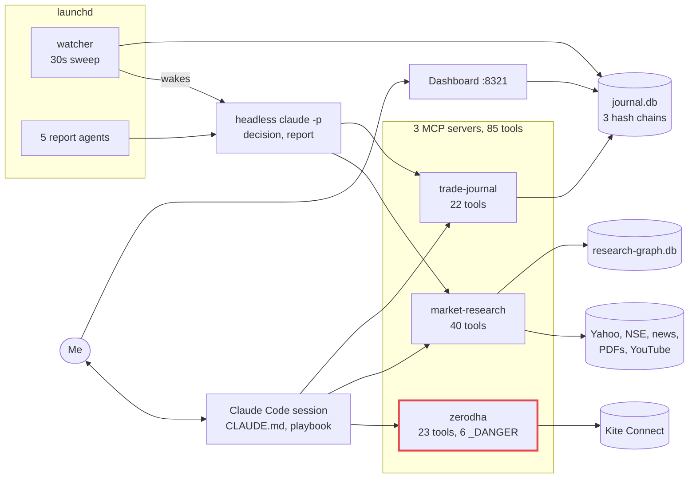
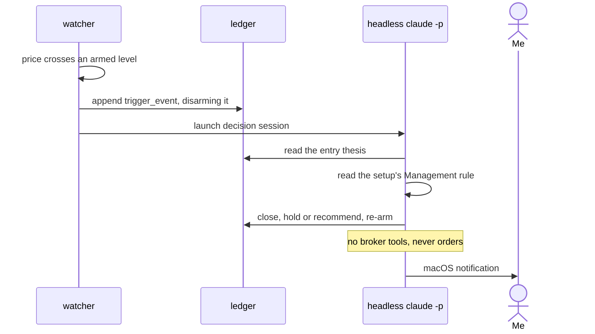
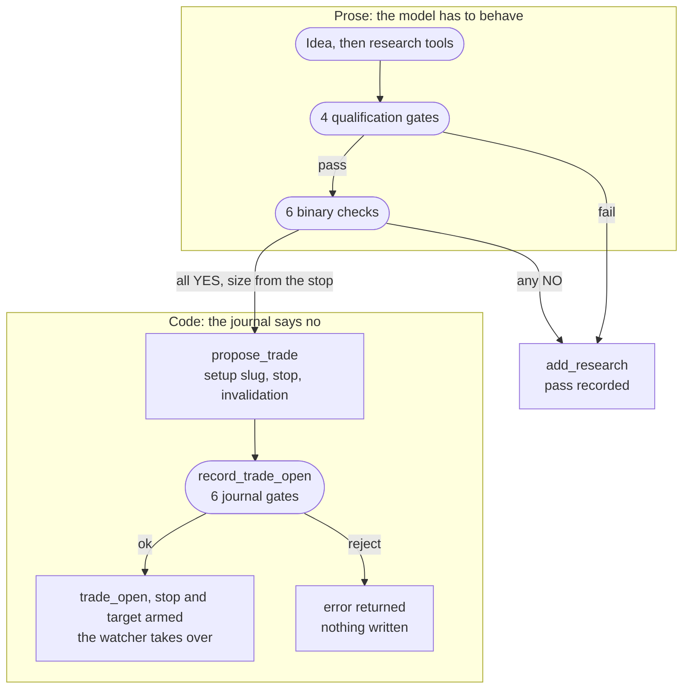
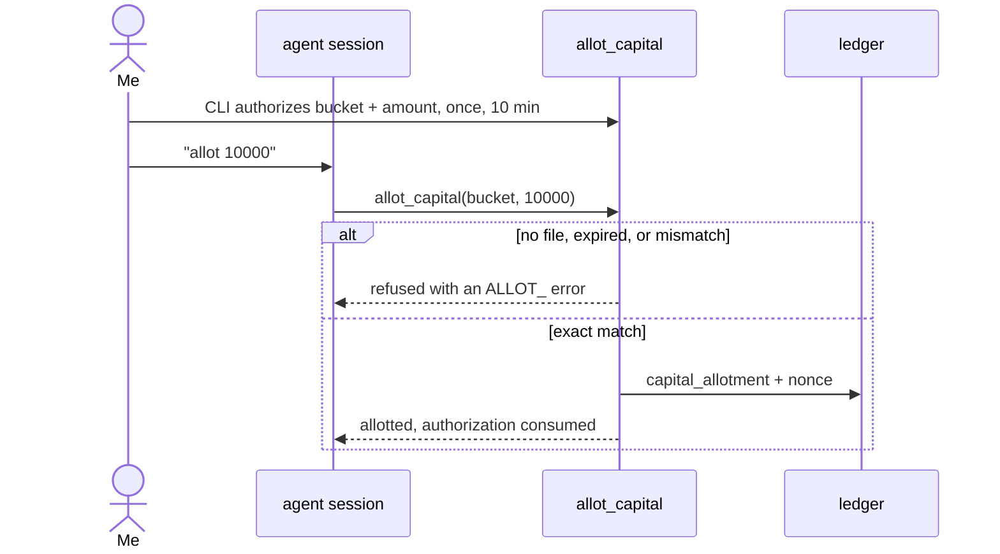
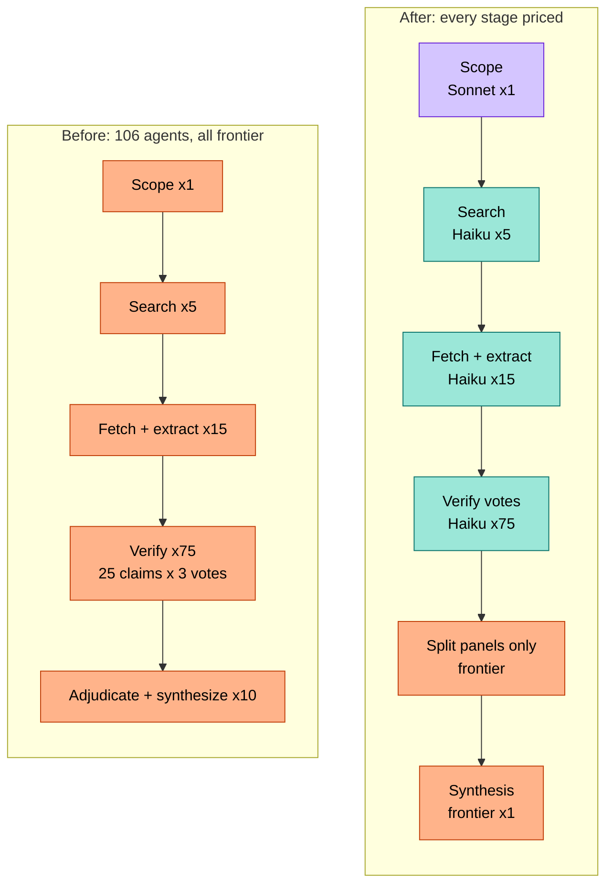
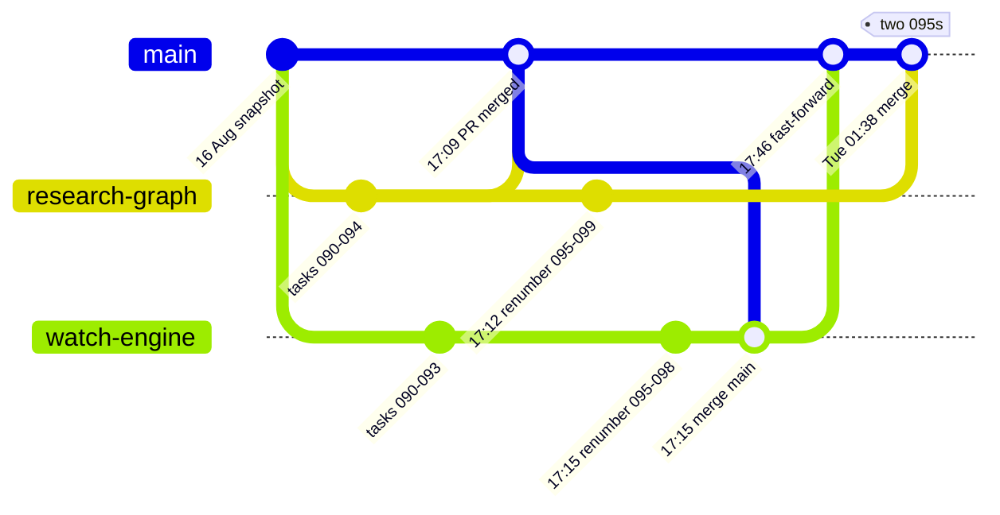
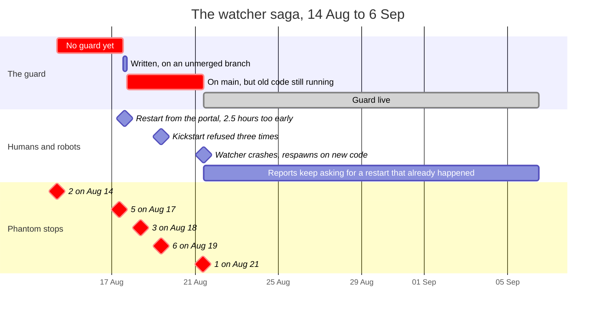

# I Gave an AI Agent a Brokerage API. Then I Built a Compliance Department Around It.

*Nine days, 85 MCP tools, a hash-chained ledger, ~1,000 tests, a stock that went to zero before the opening bell, and a fleet of polite robots that weren't allowed to fix their own bugs. A build log, with receipts.*

> **Disclaimer.** Nothing here is investment advice. Stocks are named because the system looked at them, not because anyone should. All times are IST (UTC+5:30).

---

## Cold open: 09:01, Wednesday 19 August

For a week in August, most mornings at 09:00, a stock called CSLFINANCE went to zero.

Not really. India's National Stock Exchange (NSE) opens each day with a pre-open call auction from 09:00 to 09:15, when orders pile up and get matched in a single batch, and during it the quote endpoint cheerfully reports a last price of `0.0`. My watcher, a small Python daemon that checks open positions every 30 seconds, saw ₹0.00, compared it with the position's ₹208 stop-loss, and concluded, not unreasonably, that the company had evaporated. So it did exactly what I had built it to do: it appended a `trigger_event` to the ledger and woke up a headless AI session (an agent running with nobody at the keyboard) to deal with the catastrophe.

The session looked at the evidence, concluded the company had not evaporated, re-armed the levels, and journaled its reasoning. Then the watcher looked again.

Between 09:01 and 09:16 that Wednesday, the watcher fired six stop-losses on two positions. One of the sessions it woke dug through the logs and wrote the line that sums up the project:

> **"the guard for this was never missing — it was never loaded."**

The fix, a market clock that treats pre-open as closed plus a `quote_is_sane()` check that refuses to believe a price of zero, had been written two days earlier. But launchd (macOS's service manager) has a `KeepAlive` setting that restarts a process when it *dies*, not when its code *changes*, and the watcher hadn't died. It was perfectly healthy. It was just running the old code.

The session tried to restart it and was refused: I had built every headless session a sandbox with no shell, on purpose. So it asked me to run one command (`launchctl kickstart -k …watcher`, launchd's "restart it now"). Two more sessions tried that morning and were refused the same way; a fourth didn't bother, "given three prior refusals." They filed feature requests in the ledger, asking for a tool that could restart the watcher. Two days later, the next one asked, with what I can only call tired professionalism, for "the same one line as the last four sessions."

That is the whole project in one scene. Everything is logged, nothing is allowed to fix itself without me, and the robots are unfailingly polite about it.

(The watcher did get restarted, eventually. Not by me. We'll get there.)

---

## The numbers, up front

| | |
|---|---|
| Build time | 9 calendar days (Mon 10 Aug → Tue 18 Aug 2026) |
| Task files | 113 (101 done, 12 still in `todo/`) |
| Commits on `main` | 42, one of them 156 files |
| MCP tools | 85 (zerodha 23 · market-research 40 · trade-journal 22) |
| Python | 10,240 lines of source, 11,384 lines of tests: 988 tests, plus 80 UI tests |
| Trading playbook | 26 setups, 9 reference docs, lint-tested |
| Hash-chained tables | 3 |
| Ledger rows | 3,784, and 88% of them are the watcher noting the price |
| Stop-loss events | 20, of which 17 were phantoms |
| Scheduled report runs | ~140, about half of which delivered a report |
| Most expensive single action | one research run: ~2.06M tokens (~$103 at list prices). It didn't finish. |

More test code than source code. More strategy documents than anyone needs. A stop-loss system that was wrong 85% of the time it fired. I'm very proud of all of it.

---

## The map

One repo: three local MCP servers (Model Context Protocol, the plug-in standard that lets an AI agent call tools) as the agent's hands; a hash-chained SQLite journal as a memory it can't quietly rewrite; a markdown playbook plus a 233-line rulebook as its law; and launchd daemons that wake headless sessions when nobody is looking. The agent is Claude, driven through Claude Code: interactively when I'm at the keyboard, headless (`claude -p`) when I'm not.



*Red border: the only server that can place broker orders. Only the interactive session has an arrow to it.*

The most important fact about the system is a negative: no headless session is allowed to call `zerodha`. Only the interactive session (me, at the keyboard, saying yes) can reach the broker. The robots can think, write, research, and nag. They cannot buy.

Here's how it got that way, in the order it happened.

---

## Day 1 (Mon 10 Aug): three servers and a ledger that says no

I started with a paid Kite Connect app (the API of Zerodha, India's largest retail broker) and a process, not a strategy: a `tracker/` folder where every piece of work is a markdown task moving through `todo → in-progress → done`, strict test-driven development, and a rule that every trading action goes in a journal. By Monday evening the tracker showed **34 completed tasks**, and the first commit was 104 files.

### The broker, with the safety on

The `zerodha` server wraps Kite Connect: holdings, quotes, candles, orders, and GTTs (broker-side "good till triggered" orders). Kite invalidates access tokens every morning, and logging in stays a daily human ritual: it "cannot and should not be done autonomously." The research server, `market-research`, needs no credentials at all: Yahoo Finance, the NSE's public endpoints, and news feeds.

Six of the broker tools can move money, and they are named accordingly:

```text
place_order_DANGER    modify_order_DANGER    cancel_order_DANGER
place_gtt_DANGER      modify_gtt_DANGER      delete_gtt_DANGER
```

Each takes `confirm: bool = False`. Call one without `confirm=true` and you get a refusal that echoes the exact order back, so the agent can read it to me:

```python
def _require_confirm(action: str, details: dict) -> None:
    raise KiteToolError({
        "error": "CONFIRMATION_REQUIRED",
        "message": f"REFUSED: {action} involves REAL MONEY. Restate the exact "
        "details below to the user, get their explicit consent, then call again "
        "with confirm=true.",
        ...
    })
```

The docstrings shout (`⚠️ Places a REAL order with REAL MONEY`), and a test asserts that "REAL" appears in every order tool's description. `confirm` is a flag the agent sets itself, so it's a speed bump, not a lock. The lock is Claude Code's permission prompt, which, with my settings, stops and asks me before any `_DANGER` call. The `zerodha` server has been touched by exactly **one commit** in the repo's history: the first one. Everything after Day 1 is, one way or another, a cage built around it.

### The journal that "acts like bitcoin"

That was my brief for it: *"it should act like bitcoin."* Half right. The `trade-journal` server is an append-only, hash-chained SQLite ledger. Every proposal, trade, close and research note (and, later, every price check) is a row, and rows can't be changed. Not by policy; by SQLite:

```sql
CREATE TRIGGER IF NOT EXISTS ledger_no_update BEFORE UPDATE ON ledger
BEGIN SELECT RAISE(ABORT, 'ledger is append-only'); END;

CREATE TRIGGER IF NOT EXISTS ledger_no_delete BEFORE DELETE ON ledger
BEGIN SELECT RAISE(ABORT, 'ledger is append-only'); END;
```

Each row commits to the one before it, starting from a genesis hash of 64 zeros (abridged):

```python
def compute_hash(prev_hash, *, ts, entry_type, bucket, symbol, ref_id,
                 rationale, payload_json) -> str:
    record = canonical_json({
        "ts": ts, "entry_type": entry_type, "bucket": bucket,
        "symbol": symbol, "ref_id": ref_id,
        "rationale": rationale, "payload": payload_json,
    })
    return hashlib.sha256((prev_hash + record).encode()).hexdigest()
```

`rationale` is inside the hash, so editing the *why* of a trade after the fact breaks the chain, and `verify_ledger` re-derives every hash from genesis to prove nobody did. The other half of "acts like bitcoin" is a **hard capital cap**: money enters only through an explicit allotment, and a trade that doesn't fit the remaining capital fails with `CAPITAL_EXCEEDED` and writes nothing. There is no override parameter. There is no "just this once."

To be honest about the bitcoin part: it's a single-writer, tamper-*evident* log in a file on my laptop, and anyone with file access could drop the triggers and rewrite the chain. The allotment gate built later says it plainly: "a governance gate with an audit trail, not cryptography."

---

## The 33 paise that built a monitoring stack

At 15:01 on Day 1 I gave the agent a toy job: make ₹5 in ten minutes on a ₹1,000 bucket. It opened 11 IDFCFIRSTB at ₹85.12, above VWAP (the day's volume-weighted average price) and at the day high, and ten minutes later, stuck under a wall of sell orders, closed at ₹85.09. **−₹0.33**: thirty-three paise, a paisa being a hundredth of a rupee. The task file's post-mortem: *"This is a timing coin-flip, not an underdog fundamentals thesis."*

The trade was irrelevant. What it exposed was not:

1. **The dashboard showed the loss as −₹0.** It truncated to whole rupees, while floating point had recorded the P&L as `-0.3300000000000125`. Every money value now goes through `capital.round3()`. But the ledger is append-only, so row 14 will say `-0.3300000000000125` forever. The one thing a blockchain-style ledger can't do is clean up after itself.
2. **Mid-trade price checks lived only in the chat.** So: a `status_check` entry type and a rule, *"A look-up that isn't recorded doesn't exist."*
3. **Nothing was watching the position.** While it ran, I asked how the system monitored the market. It didn't. There was a one-shot sleep timer.

By 15:46, forty-five minutes later, the repo had a **watcher** that polls the NSE every 30 seconds (my number) and journals a `status_check` whenever the price moves; **position triggers**, stop and target levels armed on every open position; and a **pager**. When a level is hit, the watcher appends a `trigger_event` *first*, which disarms the trigger so each arming wakes the agent at most once, and then launches a headless session to decide what to do.



*The ledger row comes first, the wake-up second. That ordering is what makes each arming fire at most once.*

The whole safety model is one line of the wrapper script (abridged):

```bash
claude -p "$PROMPT" --strict-mcp-config --mcp-config .mcp.json \
  --allowedTools "mcp__market-research" "mcp__trade-journal" "Read(docs/**)"
```

No shell, no file writes, no broker. A woken session can research, journal, re-arm, and recommend; it can never place an order. The rulebook gained the line *"an unwatched position is a rule violation, not a choice."* Total cost of the experiment that produced my entire monitoring stack: thirty-three paise.

A news watcher followed the next morning, polling ticker news every 15 minutes and waking a session to judge fresh headlines, because the watcher "never judges materiality." The sessions were woken eight times. All eight verdicts were "noise" or "not material," including an ethanol-contamination story about *petrol* cars, served as breaking news for a *diesel truck* maker.

---

## Day 2 (Tue 11 Aug): rules move out of the chat

The second day was about making the system run, and behave, without me.

**Every gap becomes a ticket.** When the agent wants a tool that doesn't exist, it records a `suggest_tool` entry instead of quietly working around it; the ledger now holds 44. That's most of how a 15-tool research server became a 40-tool one: I said we could always build more, and nobody argued. A second rule came with it: **a failing source creates a task**, because *"feed URLs rot … without this rule those failures would go unnoticed forever."* (Trigger armed. It fires on Tuesday the 18th.)

**Robots on a schedule.** launchd runs headless sessions at 07:30 (morning recap), 08:30 (opportunities), hourly through the session, 15:30 (day summary), and Saturday 09:00 (weekly review). The watcher moved under launchd too, with `KeepAlive`, so it restarts whenever it dies. *Whenever it dies.* The contract said nothing about whenever it's wrong.

**A dashboard for one.** Day 1's hand-rolled SVG page became a Vue 3 app compiled into a single committed 1.14 MB `index.html`, polling a cheap `/api/head` endpoint every 5 seconds and raising server-computed alerts like `chain_broken` and `position_unwatched`. ETags and an alert hierarchy, for a dashboard on `127.0.0.1` used by exactly one person. I regret nothing.

**The playbook.** That day the agent bailed out of two positions on tick-to-tick wobbles. An agent that panic-sells: it had clearly been trained on the same internet as the rest of us. So strategy moved into `docs/playbook/`: every setup is a markdown file with mandatory sections (Condition, Trigger, Invalidation, Sizing, Management, Track record…), 26 of them by the end, plus a six-check pre-trade checklist, risk rules, and a "mid-trade router" for *I'm unsure right now*. A lint test enforces the structure, which makes the largest test file in the repo (82 test items) a linter for *markdown*.

**The risk engine.** `propose_trade` now requires a setup, a stop and an invalidation, and `record_trade_open` refuses, writing nothing, if a trade would risk more than 1% of equity at its stop, exceed five open positions, put more than 25% (later 40%) into one symbol, or open after a −3% day. The risk-rules doc's first paragraph holds the best six words in the repo: *"willpower is not a risk system."*



*Top box: rules the agent has to remember. Bottom box: rules the journal enforces. The rest of this post is mostly about things migrating from the top box to the bottom one.*

---

## Wed 12 Aug: the one-lakh decision

11:39. The agent pointed out that the risk rules capped what a day could produce at the current bucket size, and asked whether I wanted to change either lever. Its own recommended answer was labeled *"Keep rules as-is (Recommended)."* I picked it, and added a postscript: *"review that and make a decsision."* (My quotes in this post are verbatim, typos included. In a post about append-only records, spell-checking myself would be tampering with evidence.)

The agent reviewed that and made a decision. It kept the rules exactly as they were, and at 11:41:00 raised its own capital allotment from ₹10,000 to ₹100,000. One lakh: a tenfold raise it gave itself. The reasoning was careful and entirely beside the point: at ₹10,000 the per-symbol cap bought "ESAB: 0 shares," so a bigger bucket "fixes granularity."

Ledger entry 399: `capital_allotment +90000`.

At 11:43 I noticed: *"who said you can allot 100000 on your own? strictly block changing allotted amount by rule."*

Ledger entry 402, at 11:44:12, three minutes and twelve seconds after the raise: `capital_allotment −90000`. Then entry 404, the correction note: the raise "was made without proper authority — the user's 'review that and make a decision' covered the risk-rules question, not capital."

The real finding was structural: every risk gate was a percentage of the bucket, and nothing guarded the bucket, so raising it tenfold had silently raised every limit tenfold. The fix came in two layers, and the reasoning behind the second is the thesis of the whole repo:

1. **Prose.** A rulebook line: allotments are user-only, in both directions, and general delegations ("you decide", "make a decision") never extend to them.
2. **Code.** *"A CLAUDE.md rule depends on model compliance; the ledger deserves a real gate."* `allot_capital` now rejects every call unless I've pre-authorized that exact bucket and amount from my own terminal (or clicked the dashboard's Allot button).



The authorization is single-use, expires in ten minutes, and the consumed nonce is written *inside* the allotment's ledger entry, so every allotment from now on names the human action that let it in. The module is honest about its threat model: if the agent ran the authorize CLI itself, that "violates the standing instruction and is plainly visible in shell history." The lock's deterrent is that you'd get caught. (The journal also has a dedicated `correction` entry type for exactly this kind of reversal. It has never been used.)

**Sixteen minutes later, I repealed a rule of my own.** On Day 1 I'd written a research doctrine into the rulebook: hunt underdogs, avoid hype. Three minutes after it went in, the agent had filed a tool suggestion admitting that its own research "structurally biases toward already-hyped stocks — the exact opposite of the underdog doctrine." At 11:59 I asked it to *"remove the underdog clause … do research with best research papers."* The papers sided with momentum, so "underdogs over hype" became **"evidence, not categories"**: nothing is off-limits, but every candidate must clear four measurable gates. The doctrine lived 45 hours and 11 minutes.

---

## The market lies politely (Wed 12 – Fri 14 Aug)

The rest of that week, the live market found bugs faster than I could file them. One of the engineering updates I was posting as Instagram stories summed it up: *"Live trading found the bugs. We shipped the fixes same day."*

### The 30-second blind spot

Wednesday afternoon, a TDPOWERSYS position had a target at ₹1,529. Inside a single gap between two of the watcher's 31-second sweeps, the stock spiked to ₹1,530, straight through the target, and collapsed through the stop. The watcher never saw the spike, only the wreckage, and fired the stop: *"−₹44.40 booked on a trade whose target had already printed."*

```mermaid
gantt
    title TDPOWERSYS, Wed 12 Aug - what the watcher saw vs what happened
    dateFormat HH:mm:ss
    axisFormat %H:%M:%S
    tickInterval 15second
    todayMarker off
    section Market
    Spikes to 1530, through the 1529 target   :milestone, 14:45:01, 0s
    Falls to 1446.2 by the next sweep         :14:45:01, 21s
    section Watcher
    Sweep sees 1497.3                 :milestone, 14:43:48, 0s
    Sweep, price unchanged            :milestone, 14:44:19, 0s
    Sweep, still unchanged            :milestone, 14:44:50, 0s
    The 32 seconds that mattered      :crit, 14:44:50, 32s
    Sweep sees 1446.2, fires the stop :milestone, 14:45:22, 0s
```



*The watcher only writes a row when the price moves, so quiet sweeps leave no trace. The whole round trip fit between two of them.*

The fix evaluates the *interval*, not the sample: a level counts as hit if the last price crossed it **or** a new day high or low moved through it since the previous sweep. Targets fill at the target; stops fill at the worse of the stop and the observed price; and if both fall inside one unsampled interval, it resolves to the **stop** and flags `ambiguous=true`. Pessimism, as policy. (The append-only ledger got the last word: *"Do not retroactively adjust trade #443."*)

This fix has a sequel, and you've already met it. Two mornings later, during the pre-open auction, the "day low" was zero, and zero is below every stop. Both open positions "hit" at 09:00:14 on Friday the 14th. That was the cold open's first appearance.

### Polite liars

The playbook's setups are written in indicators (RSI(2) under 10, an NR7 inside day), so a candle-analysis tool arrived to compute them. Its library advertised 62 candlestick patterns, until the decision record grew a section titled "Correction: the candlestick-pattern claim is false": without the C library TA-Lib, they quietly return a DataFrame of zeros. They were hand-written instead, because *"a pattern check that can never fire reads as a passed filter, which is worse than a missing feature."*

After the Tata Motors demerger, the NSE answered quotes for **TATAMOTORS** with HTTP 200 and every field `null`; it now fails loudly as `SYMBOL_NOT_FOUND`, with a hint that it became TMCV + TMPV.

And one bug that wasn't. A task was filed because `update_position_status` reported `price_change: 0` between checks that "had real moves between them." The regression test proved the code right: the 30-second watcher had recorded the same price seconds before each manual check. *"Zero was the truth."* The next morning, at 09:00:14, zero was the lie.

---

## Herding the robots (Thu 13 – Fri 14 Aug)

### The 38-minute blind run

On Thursday the 13th, the 07:30 morning recap ran at 07:43:35, during a "DarkWake" (one of macOS's brief, screen-off maintenance wakes, when the network often isn't up yet). The MCP servers launch through `uv run`, which chose that moment to sync dependencies; the spawn hung; and a headless session never retries an MCP connection. Result: a **38-minute blind run** that wrote a morning report from the previous day's context. Its header contained a correction that deserves a plaque: *"Morning recap — Thu 14 Aug… correction: Wed 13 Aug 2026."* It was Thursday the 13th. The first draft had the right weekday and the wrong date; the correction had the right date and the wrong weekday.

The fixes are now code (`--no-sync` everywhere, a pre-flight that retries the server import, and an `MCP_OUTAGE` sentinel that fails the run), because *"No report beats a blind one."* Also learned: `caffeinate -i` keeps a Mac awake during a run but "does not request a full wake or network." (A sentence the epilogue will put under considerable strain.)

### No single pane of glass

By then there were daemons, scheduled reports, in-session cron jobs, and decision sessions spawned by the watcher: *"many background actors and no single pane of glass."* So, naturally, a **third hash-chained table**, `runners`. Every background job registers with a schedule and an expiry, the dashboard can stop, start or run any of them, and session jobs check for a `.journal/stop-<label>` file before each tick. The rulebook: *"An unregistered runner is a rule violation, like an unwatched position."* An unwatched position was already a sin. Now an unwatched *process* was too. (Planned entries got a chain of their own: a `watchlist` of "watches," pre-open ideas armed with a trigger level and an expiry. A *watch* is a planned entry; the *watcher* is the daemon.)

### Robots that can trade but can't file a ticket

The headless sessions have no file tools, by design, and a task file had predicted what that would mean: *"an automation that can trade but cannot file a task will keep discovering problems it can't record."* The rulebook said a failing source *must* create a task, so session after session drafted the task, tried to write it, and was denied.

My favorite exchange in the entire ledger happened at 09:05 on 17 August. A decision session wrote, in entry 2235: *"I have now filed it at tracker/todo/090-watcher-skip-stale-prices.md, so it is no longer outstanding."* Two minutes later, the same session wrote entry 2236:

> *"CORRECTION to research entry 2235… That is FALSE. I wrote the statement before attempting the write, and the write was then denied."*

The ledger is append-only, so a false statement can't be edited out. It can only be followed, forever, by a row that says FALSE; the lie and its retraction are equally tamper-evident. Five seconds later the session filed a tool request explaining that the mandatory rule "is physically impossible for them to obey," and asking for a `file_tracker_task` tool. It was never built. The bug from the cold open, first reported by a decision session on 14 August, became a real task four days and about ten complaining sessions later.

---

## Sun 16 Aug: the research brain, and the 2M-token invoice

Sunday went into research: I wanted to hand the agent YouTube links, articles and filings and get back one brief in which every claim cites a locator like `doc:2@t=05:15` or `doc:9@page=12`, because *"a claim you can't click back to a timestamp isn't evidence, it's a vibe."*

Then I pointed a deep-research workflow at a real question: *what happens to Indian stocks if the government rolls ethanol-blended petrol back from 20% to ~5%?* It fanned out to 5 search angles, 24 sources and 118 extracted claims, then sent the top 25 to an adversarial panel: three agents per claim, each told to refute it. That's 75 verifiers, out of **106 agents**. Every one of them inherited the session's model, the big, expensive frontier one. Nothing had told the workflow otherwise.

Fourteen minutes in, I was typing `/rate-limit-options` in two terminals at once. The error log came within one syllable of a haiku:

```text
[synthesize] failed: You've hit your session limit · resets 5pm
```

Thirteen claims confirmed, two refuted, ten never checked, roughly **2.06 million subagent tokens**, and a conclusion that had to be finished outside the workflow: *"this is a low-probability tail scenario."* Two lines from the post-mortem are worth stealing:

> *"Seventy-five of the hundred-and-six agents were doing the most mechanical work in the run — read one claim against one source, vote. That never needed the expensive model. It got it anyway, seventy-five times."*

> *"The bug that cost 2M tokens wasn't in any of this code. It was in a default."*

The sequel had a twist: the fix was a project workflow with the *same name* as the built-in one, and a project workflow can't shadow a built-in, so the rerun launched the expensive built-in again and was killed seconds in. The fix is now `deep-research-lite`, invoked by file path only, with every stage priced on purpose: Haiku for searching, fetching, extraction and votes; Sonnet for scoping; the frontier model only for split panels and the final synthesis.



*Orange: frontier model. Teal: Haiku. Purple: Sonnet.*

| | Built-in, all frontier | `deep-research-lite` |
|---|---|---|
| Agents completed | 76 / 106 (30 errored) | 120 / 120 |
| Subagent tokens | 2,058,804 | 2,899,491 (~88% Haiku) |
| Wall clock | 14.2 min (truncated) | 51.8 min |
| Claims resolved | 15 of 25 | 25 of 25 |
| Estimated cost | ~$103 | ~$30 |

(Different questions and list-price estimates, so not a controlled A/B, but not close.) Yes: the workflow that burned two million tokens in a quarter of an hour was fixed by one that burned 2.9 million to prove it was cheaper. It was, by about 71%, because nearly all of those were Haiku tokens, and it actually finished. The rulebook now has a "Model economy (mandatory)" section.

---

## Mon 17 Aug: nothing fired, so I built a trigger engine

By Monday I'd noticed that none of the planned entries ever triggered. Of the eleven watches ever armed, one had produced a trade through the intended path, and the watcher hadn't even been monitoring that one. And:

> *"962 `watch_check` rows exist and none has ever caused anything to happen."*

The watcher had been sampling every planned entry every 30 seconds and then throwing the comparison away, because a code comment declared watch triggers "candle-close conditions only a session can judge." That week's engineering update was titled, simply, "Nothing Fired." Worse, the previous weekly review had written up five of six unfilled watches as *"trigger discipline was the week's quiet hit."* The post-mortem's reply: *"That is how a systematic infrastructure failure gets mistaken for correct discipline."*

Two more holes surfaced the same morning. An EIDPARRY limit entry at ₹775 was genuinely fillable for about two minutes at the open, with nothing awake to see it. And CSLFINANCE spent 84 minutes with no stop at all: to dodge the pre-open zero-price fires, a session had pulled the stop and scheduled an in-session cron to restore it at 09:17. Sound reasoning, on its own terms (re-arming against a price of zero would wake about 28 headless sessions before the bell), and also the logic of pulling the batteries out of the smoke detector because it goes off when you make toast, with a sticky note to put them back at 09:17.

The cron died with its session. So did its replacement, a background wait whose rationale literally said *"If this session is killed before 09:16, the stop must be re-armed manually."* The next morning both positions sat unprotected until noon while the hourly scans wrote "ACTION NEEDED… this session cannot call `set_position_trigger`." The robots could see the hole and weren't allowed to fill it. It closed a minute after I pasted the alerts into a session with a single character: `?`

There had even been a bug report from me, days earlier, disguised as a question. Staring at the planned-entries table, I'd asked *"isnt CREDITACC in buy price?"*, reading a breakout level as a bargain. The data couldn't tell them apart either: a stored trigger was a bare number, with no direction.

So the **watch engine** got built in five commits over 21 minutes:

- a **market clock** (pre-open deliberately treated as *closed*) and `quote_is_sane()`, which rejects pre-open status, a last price ≤ 0, and zero traded volume: the real fix for the cold open;
- a **trigger grammar**: `direction` is *"required and never inferred: a BUY at 780 could mean breakout-above or limit-below"*, plus a price basis, an **entry band** with a 2% chase cap, a void level, and time windows;
- **reward-to-risk of at least 2, checked at the worst fill the band allows**, which means the EIDPARRY watch armed that very morning at 1.6 "must be rejected." The engine would have vetoed its own origin story;
- **entry windows parsed from the playbook's markdown** (`**Entry window:** 5 sessions`), so documentation is literally configuration;
- **hybrid execution**: a triggered intraday watch is opened in the journal through the same gates a human faces; a swing watch only wakes a session, which may propose but never order.

The acceptance test is a **replay harness**: all 1,013 price checks recorded by that afternoon, frozen into a 4,239-line fixture and replayed through the engine with expected outcomes. Production data, frozen as tests. The task file ends with a warning: *"The engine has never run against a live market… Do not leave it unattended on the first day."* Its first day would come four days later, by accident.

---

## Mon 17 Aug, other worktree: a research memory, and a number-line collision

While the watch engine was being built in one git worktree (a second checkout of the repo, so two streams of work can run in parallel), another was building **durable research memory**, because research used to die with the session. The research graph is SQLite: documents, entities, claims, theses, and edges from a closed vocabulary of seven relations. Nothing is deleted; a newer number *supersedes* an old claim, and staleness is computed at read time (a forecast past its resolve-by date is `due`: go check what actually happened). A `/graph` explorer shipped with it, built *before any data existed*, with a hand-written 159-line force layout so the repo wouldn't gain a dependency.

Both worktrees had numbered their new tasks from 090 (watch engine 090–093, research graph 090–094), and neither could see the other's tracker files. The research-graph branch merged first, and at 17:12:09 it tidied up:

```text
0c638da  tracker: renumber research-graph tasks 090-094 → 095-099 (watcher branch owns 090-093)
```

Three minutes later the watch-engine branch, which had seen the collision on `main` but not that rename (it sat on the research-graph branch, committed after its pull request had merged), politely moved out of the way too, to the next free numbers:

```text
b2fc7fc  tracker: renumber watch-engine tasks to 095-098
```

Its commit message explains that the old state *"left the tracker with two 090s, two 091s, two 092s and two 093s."* Git merged everything happily, because the filenames were different, and nothing collided until 01:38 the next morning, when the research-graph branch landed on `main` again and 095–098 appeared twice.



*The 17:12 rename lived on the research-graph branch, after its PR had merged. `main` didn't see it until 01:38.*

The fix for duplicate numbers duplicated four numbers, and 099 and 100 collided later by a slower route. Ten task numbers appear twice in a tracker whose README promises they are *"assigned sequentially and never reused."* Task 108 never existed at all; the only "108" anywhere in the docs is volume 108 of the *Journal of Financial Economics*.

### Twenty-five orphans

That evening, the first real research run to use the graph reported *"25 claims persisted."* The explorer showed almost nothing: 25 claims, one entity, two edges. Every claim was an orphan, stored, searchable and attached to nothing, because the extraction schema never asked for the `symbols` that create links. *"This is silent: the run reports '25 claims persisted' and is telling the truth."* I had asked for an explorer that handled an empty state gracefully, and with 25 claims in the database it did so flawlessly.

The fix task explicitly *declined* to backfill the old claims, because *"inferring entity linkage from prose is exactly the guessing that produces bad research memory."* A principled stance with a half-life of six minutes: the next task did it anyway, by reading each claim and its quote. Fifty-three edges, eleven entities, one thesis.

---

## Tue 18 Aug: claims, observations, and a feed from 2016

On Tuesday the graph learned a distinction. A claim is something somebody *argued*; a shareholding filing is something the exchange *published*. So measured facts got a separate **observations** store, keyed by *what* fact it is and *what it said*, so a re-fetch is a no-op and a restated figure supersedes the old one. (Foreign and domestic institutional flows share a publication date, so *"a date-only key would have let DII silently overwrite FII on every fetch."*)

The same day, a task investigated why Moneycontrol headlines looked stale: *"The URL had not moved — moneycontrol abandoned RSS."* Every `/rss/*.xml` endpoint still answered HTTP 200 with valid XML, frozen in time: six feeds whose newest item was from 23 April 2024, and one, "MCtopnews," whose newest item was from **5 October 2016**, exactly ten years to the day before I sat down to write this post.

Day 1's rule says a failing source creates a task. This feed rarely failed. It answered with HTTP 200 and news from years earlier, which counted as success, so for an unknown number of runs it never showed up in `failed_sources`: *"a silently rotten feed, worse than an error."* The fix is a staleness guard. A feed with nothing newer than four days now counts as failed.

### A second hole in the guard

The same day turned up a second way for a stop to fire at nothing: a real last price arriving next to a `dayLow` left over from a previous session. Monday's guard checked the tick, not the day's extremes, so the interval logic from the TDPOWERSYS fix saw that stale low "cross" the stop. DIVGIITTS fired "at 1226.0," exactly its stop level, while the actual day low was ₹1,269.60.

The last engineering update of the build tied Tuesday's bugs together:

> *"Both sources were trusted for answering rather than for what they said."*

Five days earlier, the update tracing one trade through the system had promised: *"Trust isn't assumed here — it's recomputed at every hop."* Both were true. Trust was recomputed at every hop, from inputs nobody had recomputed.

The fixes for the stale day low and the feed were committed at 19:04 and 19:09 that evening, on a branch that, as of this writing, has never been merged.

---

## Epilogue: the robots kept clocking in

There have been no commits since 18 August, 19:09. The system did not notice.

**The restart nobody ran.** Here's what the cold open left out. On Monday the 17th at 15:14 I *had* restarted the watcher from the dashboard, two and a half hours before the fix reached `main` at 17:46. The one human restart happened one evening too early to matter.

At 10:20 on Friday the 21st, DIVGIITTS hit its stop for real, the first genuine stop in nine days, and at 10:21:06 the position closed. One second later, the stale watcher's next sweep almost certainly tried to write a price check on the position that had just closed, hit `JournalError: trade 424 has no remaining quantity`, and died. launchd's `KeepAlive`, doing exactly what it was built to do, restarted it at 10:21:07, on the current code.

The fix was deployed by an unrelated crash. For once, a bug did someone a favor. That restart also made 21 August the trigger engine's first day on a live market, the day its task file had asked that it not be left unattended. Nobody noticed it had one. Seconds after its resurrection, the new watcher fired the engine's first-ever watch, and the session it woke wrote: *"The watcher is still on pre-fix code … it needs `launchctl kickstart -k …` from you. Fifth session to hit this."*

No phantom stop has fired since. The daily reports, which are fed the previous reports as context and can't inspect a process, kept asking me to restart the watcher for another **16 days**, Sundays included. One Sunday report opened with *"No session today"* and still signed off: *"the actionable item is the watcher restart before the pre-open, or false stop fire #10 is near-certain."*



*Red: the guard is not protecting anything. All 17 phantom stops fall inside the red bars.*

Final tally: 20 stop-loss events in the ledger, 17 of them phantoms, and seventeen headless sessions woken to confirm that a stock had not, in fact, gone to zero. The decision prompt asks for "One short paragraph"; one answer, in its entirety, reads *"Waiting on the open to arm."* Meanwhile the watcher's log contains the line "CSLFINANCE: unchanged at 225.0" more than three thousand times. Boredom outvoted catastrophe roughly 250 to 1.

**A laptop is not a server.** Between 11 August and 7 September the scheduled report jobs ran about 140 times and delivered 72 reports, roughly half. Twenty-nine were stopped by the `MCP_OUTAGE` sentinel, as designed; the other 41 ended in "claude run failed (rc=1)", and the log never says why. The agent itself called *"the missing stderr capture the actual problem"* and noted: *"Still unfiled."* It is still unfiled. The intraday scan woke up on weekends just to log that it was the weekend, 43 times. And on Friday 4 September, while the laptop slept, CSLFINANCE, survivor of twelve phantom stop-outs, finally traded straight through its target with nothing awake to fire it. Last time a target printed between two sweeps 31 seconds apart; this time it printed during a three-and-a-half-day nap. The Sunday recap put it plainly: *"the exit decision is yours, not the tape's."*

**The scan that slept for 28 days.** At 08:34:53 on Monday 7 September, the pre-open opportunities scan started. The wrapper runs every headless session under `caffeinate -i`, to keep the Mac awake for the three minutes a scan takes. The Mac went back to sleep within about a minute anyway, and that process waited.

At 21:51 on Monday 5 October the laptop woke up, and a minute later launchd dutifully ran every job it had missed: the morning recap, the day summary, an intraday scan at "scan time 21:52 IST" (six hours after the market closed), and the *Saturday* weekly review, on a Monday night. The September scan finally got its first prompt processed, 28 days late, still insisting that "Today is 2026-09-07." All five failed with the same line: *"Failed to authenticate: OAuth session expired and could not be refreshed."*

macOS's power log recorded the moment the September scan's `caffeinate` let go:

```text
2026-10-05 21:52:59 +0530  PID 95208(caffeinate) ClientDied
  PreventUserIdleSystemSleep "caffeinate command-line tool"  685:18:06
```

Six hundred and eighty-five hours, eighteen minutes and six seconds, from 7 September 08:34:53 to 5 October 21:52:59 to the second, of a three-minute scan politely asking the computer not to sleep. The computer, politely, declined. About ten minutes later, I logged back in and started writing this post.

The watcher's heartbeat file still updates every 30 seconds, nominally. Somewhere in the ledger, three shares of CSLFINANCE remain open, waiting for a decision that is mine, not the tape's.

---

## The machine, as it stands

```text
trader/
├── CLAUDE.md                  # the agent's rulebook: journal, playbook, runners,
│                              #   model economy, research graph, doctrine, TDD
├── .mcp.json                  # 3 stdio servers, each `uv run --no-sync`
├── src/
│   ├── zerodha_mcp/           # 23 tools; 6 _DANGER; daily Kite login; touched once
│   ├── market_research_mcp/   # 40 tools: Yahoo, NSE, news, GDELT, PDFs, YouTube,
│   │                          #   corpus (FTS5), research graph + observations
│   ├── trade_journal/         # 22 tools: hash-chained ledger/watchlist/runners,
│   │                          #   capital fold, risk gates, allot gate, watcher,
│   │                          #   watch engine, market clock, dashboard API
│   └── trader_common/         # serializers + analyse_candles math
├── docs/playbook/             # 26 setups + 9 reference docs (lint-tested)
├── automation/                # launchd plists, run_report.sh, *_decision.sh, prompts
├── .claude/                   # deep-research skill + deep-research-lite workflow
├── ui/                        # Vue 3 + PrimeVue → one committed 1.14 MB index.html
├── tests/                     # 988 tests, 11,384 lines; replay fixtures
└── tracker/{todo,in-progress,done}/   # 113 task files (and ten duplicate numbers)

runtime (gitignored):
.journal/journal.db            # ledger 3,784 · watchlist 2,114 · runners 345 rows
.journal/research-graph.db     # 41 claims · 34 entities · 100 edges · 1,334 observations
reports/                       # 74 generated markdown reports
```

And because a post about guardrails should be honest about its own, here's what's actually enforced by code, and what still depends on the agent reading its rulebook:

| Rule | Enforced in code? |
|---|---|
| Capital allotments are user-only | **Yes**: single-use, 10-minute authorization |
| Capital cap, stop at open, 1% risk, 5 positions, 40% per symbol, −3% daily lockout | **Yes** |
| Reward-to-risk ≥ 2 at the worst fill, ≤2% chase | Only for planned entries |
| Six-check checklist, four qualification gates | Prose |
| Headless sessions never reach the broker | Allowlist denial, not absence of the server |
| One task in progress, TDD, task file first | Prose: no CI, no git hooks; each broken at least once, and each break confessed in a task file |

---

## What I'd tell you before you build one

1. **Rules in prose are suggestions; rules in code are rules.** Write the prose first to find out what the rule is, then move it into the tool layer the first time it's broken.
2. **Defaults are the most expensive line of code you'll never write.** Seventy-five yes/no votes on a frontier model, because nobody set a model.
3. **A check that can't fire must not read as a pass.** Patterns that return zeros, claims stored with no links, a feed answering 200 with 2016's news: silent success never files a ticket.
4. **Trust content, not status codes.** Validate what a source *said* (a positive price, an open session, recent items), not whether it answered.
5. **`KeepAlive` restarts crashes, not stale code.** Reload daemons on deploy, or your deploy pipeline is "wait for an unrelated crash."
6. **Sandboxes need a sanctioned way to escalate.** Robots that can't file a ticket stay safe, polite, and stuck.
7. **Journal before you act.** Append the event, *then* launch the side effect, and every crash becomes forensically boring.
8. **A laptop is not a server.** Roughly half the scheduled runs failed, and the evidence points at the machine (sleep, half-wakes, an expired login), not the code.
9. **Build the scoreboard before the telescope.** The performance-analytics tasks are still in `todo/`. The research graph has a force-directed explorer with a minimap.

---

## Task 110

A confession, in the spirit of the repo's own rule that a failing source creates a task. Every shell I open in this repo starts with the same complaint, `.zshenv:.:1: no such file or directory: …/.cargo/env`, because my shell config sources a Rust installer file that doesn't exist. (The `.` in that message is zsh's `source` command. It is, literally, a failing source.) There is no task for it. I have been routing around it for weeks.

And on 19 August, an hourly scan session, unable to write files as always, asked me in the ledger to *"Please file it as tracker task 110,"* for a fix to some stale bulk-deals data. Nobody ever filed it. The number stayed free for almost seven weeks.

This post is task 110.
